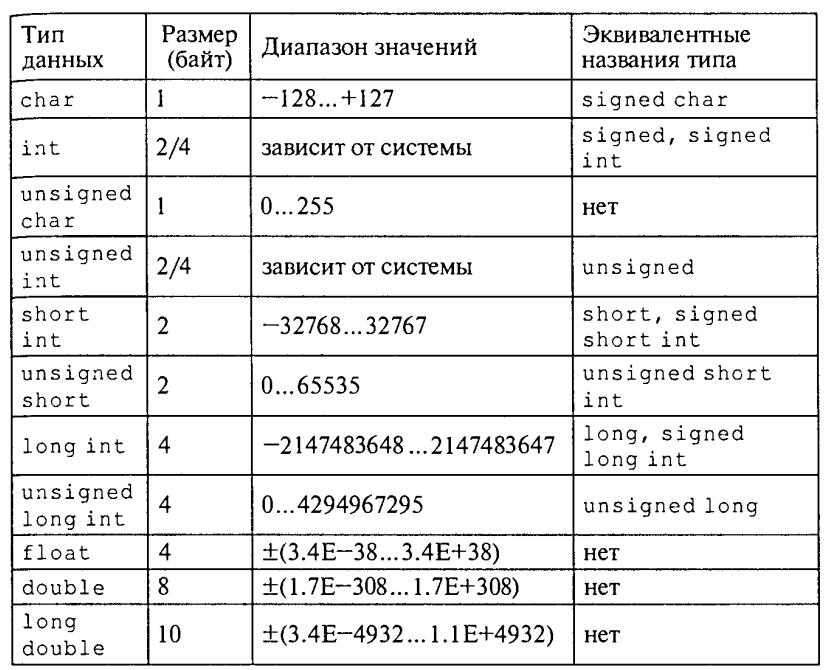
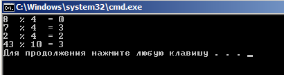

Введение в Си++
================

История и назначение С++
--------------------------

C (рус. Си) — компилируемый статически типизированный язык программирования общего назначения, разработанный в 1969—1973 годах сотрудником Bell Labs Деннисом Ритчи как развитие языка Би. Первоначально был разработан для реализации операционной системы UNIX, но, впоследствии, был перенесён на множество других платформ. Благодаря близости по скорости выполнения программ, написанных на Си, к языку ассемблера, этот язык получил широкое применение при создании системного программного обеспечения и прикладного программного обеспечения для решения широкого круга задач. Язык программирования С оказал существенное влияние на развитие индустрии программного обеспечения, а его синтаксис стал основой для таких языков программирования, как C++, C#, Java и D.

C++ — компилируемый статически типизированный язык программирования общего назначения.

Поддерживает такие парадигмы программирования как процедурное программирование, объектно-ориентированное программирование, обобщённое программирование, обеспечивает модульность, раздельную компиляцию, обработку исключений, абстракцию данных, объявление типов (классов) объектов, виртуальные функции. Стандартная библиотека включает, в том числе, общеупотребительные контейнеры и алгоритмы. C++ сочетает свойства как высокоуровневых, так и низкоуровневых языков. В сравнении с его предшественником — языком C, — наибольшее внимание уделено поддержке объектно-ориентированного и обобщённого программирования.

C++ широко используется для разработки программного обеспечения, являясь одним из самых популярных языков программирования. Область его применения включает создание операционных систем, разнообразных прикладных программ, драйверов устройств, приложений для встраиваемых систем, высокопроизводительных серверов, а также развлекательных приложений (игр). Существует множество реализаций языка C++, как бесплатных, так и коммерческих и для различных платформ. Например, на платформе x86 это GCC, Visual C++, Intel C++ Compiler, Embarcadero (Borland) C++ Builder и другие. C++ оказал огромное влияние на другие языки программирования, в первую очередь на Java и C#.

Синтаксис C++ унаследован от языка C. Одним из принципов разработки было сохранение совместимости с C. Тем не менее, C++ не является в строгом смысле надмножеством C; множество программ, которые могут одинаково успешно транслироваться как компиляторами C, так и компиляторами C++, довольно велико, но не включает все возможные программы на C.

Разработчиком языка Си++ является Бьерн Страуструп. В своей работе он опирался на опыт создателей языков Симула, Модула 2, абстрактных типов данных. Основные работы велись в исследовательском центре компании Bell Labs.

Непосредственный предшественник Си++ – язык Си с классами – появился в 1979 году, а в 1997 году был принят международный стандарт Си++, который фактически подвел итоги его 20-летнего развития. Принятие стандарта обеспечило единообразие всех реализаций языка Си++. Не менее важным результатом стандартизации стало то, что в процессе выработки и утверждения стандарта язык был уточнен и дополнен рядом существенных возможностей.

Язык Си++ является универсальным языком программирования, в дополнение к которому разработан набор разнообразных библиотек. Поэтому, строго говоря, он позволяет решить практически любую задачу программирования. Тем не менее, в силу разных причин (не всегда технических) для каких-то типов задач он употребляется чаще, а для каких-то – реже.

Си++ широко используется в системном программировании. На нем можно писать высокоэффективные программы, в том числе операционные системы, драйверы и т.п. Язык Си++ – один из основных языков разработки трансляторов.

Поскольку системное программное обеспечение часто бывает написано на языке Си или Си++, то и программные интерфейсы к подсистемам ОС тоже часто пишут на Си++.

Распределенные системы, функционирующие на разных компьютерах, также разрабатываются на языке Си++. Этому способствует то, что у широко распространенных компонентных моделей CORBA (CORBA определяет, каким образом программные компоненты, распределенные по сети, могут взаимодействовать друг с другом вне зависимости от окружающих их операционных систем и языков реализации) и COM есть удобные интерфейсы на языке Си++.

Обработка сложных структур данных – текста, бизнес-информации, Internet-страниц и т.п. – одна из наиболее распространенных возможностей применения языка. В прикладном программировании, наверное, проще назвать те области, где язык Си++ применяется мало.

Разработка графического пользовательского интерфейса на языке Си++ выполняется, в основном, тогда, когда необходимо разрабатывать сложные, нестандартные интерфейсы. Простые программы чаще пишутся на языках Visual Basic, Java и т.п.

Программирование для Internet в основном производится на языках Java, VBScript, Perl.

Язык Си++ в настоящее время является одним из наиболее распространенных языков программирования в мире.

**Простейшая программа на языке Си++**
Самая короткая программа на языке Си++ выглядит так:

::

	//Моя первая программа
	#include <iostream>
	using namespace std;
 
	int main()
	{
	  cout<< "Моя первая программа на С++\n";
	  cin.get();
	  return 1;
	}
	
Первая строчка в программе – комментарий, который служит лишь для пояснения. Признаком комментария являются два знака деления подряд **//** .

/*
 это комментарий, который может состоять
 из нескольких строчек
 */

Чтобы получить доступ к стандартным функциям, которые поставляются с компилятором, необходимо подключить заголовочный файл используя препроцессорную директиву — ``#include``

Каждая программа в C++ имеет одну функцию, её называют главная или **main**-функция, выполнение программы начинается именно с этой функции. Из главной функции, вы также можете вызывать любые другие функции, неважно, являются ли они написанными нами, или, как упоминалось ранее, предоставляются компилятором.

У функции может быть результат или возвращаемое значение. Если функция не возвращает никакого значения, то это обозначается ключевым словом **void**. В фигурных скобках записывается тело функции – действия, которые она выполняет. Оператор **return 1** означает, что функция возвращает результат – целое число 1.

Команда **cin.get()**. Это еще один вызов функции, которая считывает данные из входного потока данных и ожидает нажатия клавиши ENTER. Эта команда сохраняет консольное окно от закрытия, до тех пор пока не будет нажата клавиша ENTER. Это даёт время для того, чтобы посмотреть результат выполнения программы.

По достижении конца главной функции (закрывающая фигурная скобка), программа вернёт значение 0 для операционной системы. Это возвращаемое значение является важным, поскольку, проанализировав его, ОС может судить о том,   успешно завершилась программа или нет. Возвращаемое значение 0 означает успех и возвращается автоматически (но только для типа данных int, другие функции, требуют вручную возвращать значение), но если необходимо вернуть что-то другое, например 1, то это делается вручную (return 1;).

Обратите внимание, что при печати из переменной кавычки не используются. Отсутствие кавычек сообщает компилятору, что есть переменная, и, следовательно, о том, что программа должна проверять значение переменной для того, чтобы заменить имя переменной на её значение при выполнении. Несколько операторов сдвига в одной строке вполне приемлемо и вывод будет выполняться в том же порядке. Вы должны разделять строковые литералы (строки, заключенные в кавычки) и переменные, давая каждому свой оператор сдвига **<<**. Попытка поставить две переменные вместе с одним оператором сдвига **<<** выдаст сообщение об ошибке. 

*Точка с запятой* в конце каждой команды - обязательное требование. Если отсутствует точка с запятой, компилятор выдаст сообщение об ошибке при попытке скомпилировать программу.


Этапы работы с программой на С++
---------------------------------------

Прямоугольниками отображены системные программы, а блоки с овальной формой обозначают файлы на входе и на выходе этих программ

.. figure:: 02_compile.png
       :scale: 100 %
       :align: center
       :alt: asda
       
1. С помощью текстового редактора формируется текст про­граммы и сохраняется в файле с расширением срр (example.срр).

2. Осуществляется этап *препроцессорной* обработки, содержа­ние которого определяется *директивами препроцессора*, рас­положенными перед заголовком программы (функции). В част­ности, по директиве **#include** препроцессор подключает к тек­сту программы заголовочные файлы (*.h) стандартных библио­тек.

3. Происходит *компиляция* текста программы на Си++. В ходе компиляции могут быть обнаружены синтаксические ошибки, которые должен исправить программист. В результате успешной компиляции получается объектный код программы в файле с рас­ширением **obj**. Например, **example.obj**.

4. Выполняется этап компоновки с помощью системной про­граммы Компоновщик (Linker). Этот этап еще называют редак­тированием связей. На данном этапе к программе подключаются библиотечные функции. В результате компоновки создается ис­полняемая программа в файле с расширением **ехе**. Например, **example.exe**.

:Компиля́тор: программа, переводящая текст, написанный на языке программирования, в набор машинных кодов
:Компиля́ция: трансляция программы, составленной на исходном языке высокого уровня, в эквивалентную программу на низкоуровневом языке, близком машинному коду (абсолютный код, объектный модуль, иногда на язык ассемблера), выполняемая компилятором.


Элементы языка С++
---------------------

Алфавит
~~~~~~~~~~~~~

Алфавит. В алфавит языка Си++ входят:

* латинские буквы: от a до z (строчные) и от А до Z (прописные);
* десятичные цифры: 0, 1, 2, 3, 4, 5, 6, 7, 8, 9;
* специальные символы:" { } , I [ ] ( ) + - / % \ ; ' : = > ! ? < & # ~ ^ . *

К специальным символам относится также пробел. 
В комментариях, строках и символьных константах могут ис­пользоваться и другие знаки (например, русские буквы). 
Комбинации некоторых символов, не разделенных пробелами, интерпретируются как один значимый символ. К ним относятся:

++ — == && || «» >= <= += - = *= / = ?: /* */ //

Идентификаторы
~~~~~~~~~~~~~~~~~~~~~

Для символического обозначения величин, имен функций и т.п. используются имена или идентификаторы. Идентификаторы в языке Си++ – это последовательность знаков, начинающаяся с буквы или знака подчеркивания. В идентификаторах можно использовать заглавные и строчные латинские буквы, цифры и знак подчеркивания. Длина идентификаторов произвольная. 

**Примеры правильных идентификаторов:**

*abc*

*A12*

*NameOfPerson*

*BYTES_PER_WORD*

.. note:: abc и Abc – два разных идентификатора, т.е. заглавные и строчные буквы различаются. 

**Примеры неправильных идентификаторов:**

12X 
a-b

Служебные слова
~~~~~~~~~~~~~~~~

Служебные слова в Си++ — это идентификаторы, назначение которых однозначно определено в языке. Они не могут быть использованы как свобод­но выбираемые имена. Полный список служебных слов зависит от реализации языка, т. е. различается для разных компиляторов. Од­нако существует неизменное ядро, которое определено стандар­том Си++.

.. figure:: 02_system_words.png
       :scale: 100 %
       :align: center
       :alt: asda

Типы данных
----------------

В Си++ имеется четыре базовых арифметических (число­вых) типа данных. Из них два целочисленных — **char**, **int** — и два плавающих (вещественных) — **float** и **double**. Также, в
программах можно использовать некоторые модификации этих ти­пов, описываемых с помощью служебных слов — модификаторов: 
* Модификаторы размера — **short** (короткий) и **long** (длинный)
* Модификатора знаков — **signed** (знаковый) и **unsigned** (беззнаковый). Знаковые модификаторы при­
меняются только к целым типам.
Ранее упоминалось,что тип величины связан с ее формой внутреннего представления, множеством принимаемых значений и множеством операций, применимых к этой величине.

**Схема типов данных**


**Арифметические типы данных Си++**



Описание переменных
~~~~~~~~~~~~~~~~~~~~~~~

Программа оперирует информацией, представленной в виде различных объектов и величин. Переменная – это символическое обозначение величины в программе. Значение   переменной (или величина, которую она обозначает) во время выполнения программы может изменяться.

С точки зрения архитектуры компьютера, переменная – это символическое обозначение ячейки оперативной памяти программы, в которой хранятся данные. Содержимое этой ячейки – это текущее значение переменной.
В языке Си++ прежде чем использовать переменную, ее необходимо оописать.

**Синтакис:**

*имя_типа список_переменных;*

**Примеры описаний:**

**char** symbol,сс;

**unsigned char** code;

**int** number,row;

**unsigned long** long_number;

**float** x,X,cc3;

**double** e,b4;

**long double** max_num;

Тип переменной определяет, какие возможные значения эта переменнаяможет принимать и какие операции можно выполнять над данной переменной. Тип переменной изменить нельзя.

**Инициализация переменных**
Вместе с описанием можно присвоить значение

::

	float pi=3.14159,с=1.23;
	unsigned int year=2000;

Константы
-------------


Запись целых констант
~~~~~~~~~~~~~~~~~~~~~~~~~~

*Целые десятичные числа* начинающиеся не с нуля, например: 4, 356, —128.

*Целые восьмеричные числа*, запись которых начинается с нуля, например: 016, 077.

*Целые шестнадцатеричные числа*, запись которых начинается с символов Ох, например: OxlA, 0x253, OxFFFF.

Запись вещественных констант
~~~~~~~~~~~~~~~~~~~~~~~~~~~~~~

Если в записи числовой кон­станты присутствует десятичная точка (2.5) или экспоненциаль­ное расширение (1Е-8), то компилятор рассматривает ее как ве­щественное число и ставит ей в соответствие тип **double**.
Примеры вещественных констант: 44.0 3.14159 44Е0 1.5Е-4.


Использование суффиксов
~~~~~~~~~~~~~~~~~~~~~~~~~~~~~~~~

Программист может явно задать тип константы, используя для этого суффиксы. Существуют три вида
суффиксов: F ( f ) - float ; U(u) - unsigned ; L ( l ) - long (для целых и вещественных констант). Допускается совместное использование суффиксов U и L в вариантах UL или LU.

Примеры: 
3,14159F — константа типа floaf , под которую выделяется 4 байта памяти;

3,14L — константа типа long double, занимает 10 байт;

50000U — константа типа unsigned i n t , занимает 2 байта памяти (вместо четырех без суффикса);

0LU — константа типа unsigned long, занимает 4 байта;

24242424UL — константа типа unsigned long, занимает 4 байта.

Запись символьных и строковых констант
~~~~~~~~~~~~~~~~~~~~~~~~~~~~~~~~~~~~~~~~~

Символьные константы заключаются в апострофы. 

Например: 'A' , 'а' , '5' , '+'. 

Строковые константы, представляющие собой *символьные последова­тельности*, заключаются в двойные кавычки. Например: "rezult", "введите исходные данные".

**Управляющие символы** 

Их назначение — управление выводом на экран. Как известно, такие символы расположены в начальной части кодовой таблицы ASCII (коды от 0 до 31) и неимеют графического представления. В программе на Си они изоб­ражаются парой символов, первый из которых '\' . Вот некото­рые из управляющих символов:

``'\n'`` — переход на новую строку 
``'\t'`` — горизонтальная табуляция 
``'\а'`` — подача звукового сигнала

Именованные константы
~~~~~~~~~~~~~~~~~~~~~~~~~~~

Для их определения используется служебное слово **const** принято называть **квалификатором доступа**. Квалификатор const указывает на то, что данная величина не может изменяться в течение всего времени работы программы. В частно­сти, она не может располагаться в левой части оператора присва­ивания. Примеры описания константных переменных:

::

	const float pi=3.14159;
	const int iMIN=l, iMAX=1000;

Определение констант на стадии препроцессорной обработки
~~~~~~~~~~~~~~~~~~~~~~~~~~~~~~~~~~~~~~~~~~~~~~~~~~~~~~~~~~~

Препроцессорная директива **#define**

:Директива **#define**: определяет идентификатор и последовательность символов, которой будет замещаться данный идентификатор при его обнаружении в тексте программы. Идентификатор так­же называется именем макроса, а процесс замещения называется подстановкой макроса. Стандар­тный вид директивы следующий:

::

	#define имя_макроса последовательность_символов

Например:

::

	#define iMIN l
	#define iMAX 1000

Тип констант явно не указывается и определяется по форме записи. В конце директивы **не ставится** *точка с запятой.*

Идентификаторы *iMAX* и *iMIN* не требуют описания внутри программы

Перечисляемые константы
~~~~~~~~~~~~~~~~~~~~~~~~~

Данное средство языка по­зволяет определять последовательность целочисленных именован­ных констант.
Описание перечисляемого типа начинается со слу­жебного слова enum, а последующий список констант заключает­ ся в фигурные скобки. Например:

::
	
	enum { A , B , C , D };

В результате имени А будет сопоставлена константа 0, имени B — константа 1, C — 2, D — з. По умолчанию значение первой константы равно нулю. 
Для любой константы можно явно указать значение. Например:

::

	enum {A=10, B, C, D};

В результате будут установлены следующие соответствия: А=10, B=11, C=12, D=13
Возможен и такой вариант определения перечисления:

::

	enum {A=10,B=20,C=35,D=100};
Если перечисляемому типу дать имя, то его можно использо­вать в описании переменных. 
Например:

::
	
	enum metal {Fe,Co,Na,Cu,Zn};
	metal Met1,Met2;

Здесь идентификатор **metal** становится именем типа. После такого описания в программе возможны следующие операторы:

::
	
	Met1=Na;
	Met2=Zn;

Операции и выражения
-----------------------

:Выражение: Конструкция, составленная из констант, переменных, знаков, операций, функций, скобок. Выражение определяет порядок вычис­ления некоторого значения. Если это числовое значение, то такое выражение называют **арифметическим**.

Арифметические операции
~~~~~~~~~~~~~~~~~~~~~~~~~~~

C++ существуют следующие арифметические операции:

* + — сложение;

* - — вычитание;

* * — умножение;

* / — деление ;

* % — остаток от деления.

* ++ унарная операция увеличения на единицу (инкремент);

* -- унарная операция уменьшения на единицу (декремент).

Все операции, кроме деления по модулю, применимы к лю­бым числовым типам данных. Операция **%** применима только к целым числам.

При делении (/), если делимое и делитель — целые числа, то и результат — целое число.
Если хотя бы один из операндов имеет вещественный тип, то и результат будет вещественным. Например, операции 5./3, 5.0/3.0 , 5/3.0 дадут вещественный результат 1.6666

**Приоритет операций**

* ++, --

* - (унарный минус)

* *, / %

* +, -

Ниже представлен программный код использующий арифметические операции в C++.

::

	#include <iostream>
	#include<clocale>
	#include<iomanip>
	using namespace std;
	 
	int main()
	{
	    setlocale(LC_CTYPE,"rus");
		double sum, razn, umnozh, div; // объявление переменных через запятую
	    double a1; // отдельное объявление переменной a1
	    double a2; // отдельное объявление переменной a2
	    cout << "Введите первое число: ";
	    cin >> a1;
	    cout << "Введите второе число: ";
	    cin >> a2;
	    sum  = a1 + a2;  // операция сложения
	    razn = a1 - a2;  // операция вычитания
	    umnozh  = a1 * a2;  // операция умножения
	    div  = a1 / a2;  // операция деления
	    cout << a1 << "+" << a2 << "= " << sum  << endl;
	    cout << a1 << "-" << a2 << "= " << razn << endl;
	    cout << a1 << "*" << a2 << "= " << umnozh << endl;
	    cout << a1 << "/" << a2 << "= " <<fixed<<setprecision(3)<<div<< endl;
	    system ("pause");
	    return 0;
	}

Пример использования арифметической операции **%** — остаток от деления

::

	#include <iostream>
	using namespace std;
	 
	int main()
	{
	    cout << "8  % 4  = " << 8 % 4   << endl; // выполнение операции "остаток от деления"
	    cout << "7  % 4  = " << 7 % 4   << endl;
	    cout << "2  % 4  = " << 2 % 4   << endl;
	    cout << "43 % 10 = " << 43 % 10 << endl;
	    system("pause");
	    return 0;
	}

Результат:


       
Операции отношения
~~~~~~~~~~~~~~~~~~~~~~~~~

* < меньше
* <= меньше или равно,
* > больше
* >= больше или равно
* = равно,
* !=не равно.

В стандарте Си нет логического типа данных. Поэтому результатом операции отношения является целое число: если отношение истинно — то 1, если ложно — то 0.

Примеры отношений:

а<0, 101>=105, 'а'=='А' 'а'!='А'

Результатом второго и третьего отношений будет 0 — ложь; результат четвертого отношения равен 1 — истина; результат пер­вого отношения зависит от значения переменной а.

Логические операции
~~~~~~~~~~~~~~~~~~~~~~~~~~

* ! операция отрицания (НЕ),
* && конъюнкция, логическое умножение (И),
* || дизъюнкция, логическое сложение (ИЛИ).

Например, логическое выражение, соответствующее системе неравенств 0 <х< 1 в программе на Си++ запишется в виде следую­щего логического выражения:

::

	х>0 && х<1

Операция присваивания
~~~~~~~~~~~~~~~~~~~~~~~~~~~

Знак операции присваивания **=**. 

Присваивание, как любой другой знак операции, может несколько раз входить в выражение. 
Например:

::

	а=b=с=х+у;

Присваивание имеет самый низкий приоритет (ниже только у операции «запятая»). Кроме того, операция присваивания — правоассоциативная. Это значит, что несколько подряд расположен­ных присваиваний выполняются справа налево. Поэтому в приве­денном выше выражении первой выполнится операция сложе­ния, затем переменной **с** присвоится значение суммы, затем это значение присвоится переменной **b** и в конце — переменной **а**.

В языке Си имеются дополнительные операции присваивания, совмещающие присваивание с выполнением других операций. Среди них: 

* +=, - = , /=, *=, %=. 

Приоритет у них такой же, как и у простого присваивания. Примеры использования этих операций:

* а+=2 эквивалентно а=а+2,
* х-=a+b эквивалентно х=х-(а+Ь),
* р/=10 эквивалентно р=р/10,
* ```m*=n``` эквивалентно m=m*n,
* r%=5 эквивалентно r=r%5.

.. note:: Вместо выражения а=а+2 предпочтительнее пи­сать в программе а+=2, поскольку второе выражение будет вы­числяться быстрее.0


Приведение типов при вычислении выражений.
~~~~~~~~~~~~~~~~~~~~~~~~~~~~~~~~~~~~~~~~~~~~

В языках программирования высокого уровня работает ряд общих правил записи выражений:

* все символы, составляющие выражение, записываются в строку (нет надстрочных и подстрочных символов);
* в выражении проставляются все знаки операций;
* при записи выражения учитываются приоритеты операций;
* для влияния на последовательность операций используются круглые скобки.

В процессе вычисления выражений с разнотипными операндами производится автоматическое преобразование типов величин:

* преобразование не выполняется, если оба операнда имеют одинаковый тип;
* при разных типах операндов происходит приведение величины с младшим типом к старшему типу (кроме операции присваи­вания);
* при выполнении операции присваивания величина, полученная в правой части, преобразуется к типу переменной, сто­ящей слева от знака =.

Старшинство типов друг по отношению к другу определяется по следующему принципу: старший тип включает в себя все зна­чения младшего типа как подмножество. Вещественные (плаваю­щие) типы являются старшими по отношению к целым.

Целые типы повозрастанию старшинства расположены в таком порядке:

char—>shot->int—>long

Порядок старшинства вещественных типов следующий:

float->double—>long double

.. toctree::

    02_langcpp_01_intro
    02_langcpp_05_progr

