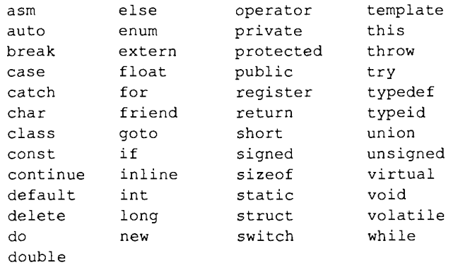
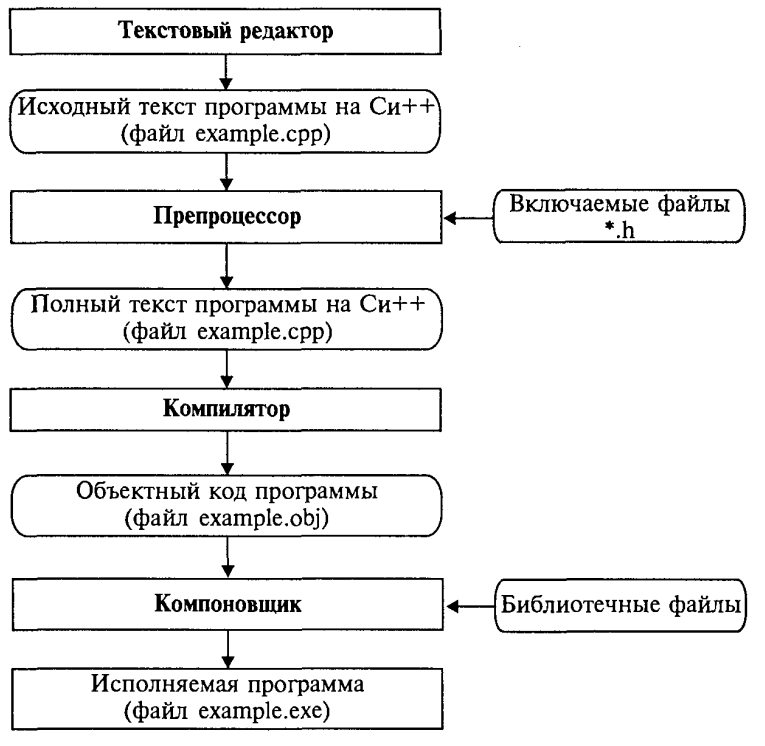

Элементы языка С++
------------------

Алфавит
"""""""
Алфавит. В алфавит языка Си++ входят:
* латинские буквы: от a до z (строчные) и от А до Z (прописные);
* десятичные цифры: 0, 1, 2, 3, 4, 5, 6, 7, 8, 9;
* специальные символы:" { } , I [ ] ( ) + - / % \ ; ' : = > ! ? < & # ~ ^ . *
К специальным символам относится также пробел.
В комментариях, строках и символьных константах могут ис­пользоваться и другие знаки (например, русские буквы). 
Комбинации некоторых символов, не разделенных пробелами, интерпретируются как один значимый символ. К ним относятся:
++ — == && || «» >= <= += - = *= / = ?: /* */ //

Идентификаторы
""""""""""""""

Для символического обозначения величин, имен функций и т.п. используются имена или идентификаторы. Идентификаторы в языке Си++ – это последовательность знаков, начинающаяся с буквы или знака подчеркивания. В идентификаторах можно использовать заглавные и строчные латинские буквы, цифры и знак подчеркивания. Длина идентификаторов произвольная. 

**Примеры правильных идентификаторов:**
*abc*
*A12*
*NameOfPerson*
*BYTES_PER_WORD*

.. note:: abc и Abc – два разных идентификатора, т.е. заглавные и строчные буквы различаются. 

**Примеры неправильных идентификаторов:**

12X 
a-b

Служебные слова
"""""""""""""""
Служебные слова в Си++ — это идентификаторы, назначение которых однозначно определено в языке. Они не могут быть использованы как свобод­но выбираемые имена. Полный список служебных слов зависит от реализации языка, т. е. различается для разных компиляторов. Од­нако существует неизменное ядро, которое определено стандар­том Си++.

Прямоугольниками отображены системные программы, а блоки с овальной формой обозначают файлы на входе и на выходе этих программ

       
1. С помощью текстового редактора формируется текст про­граммы и сохраняется в файле с расширением срр (example.срр).
2. Осуществляется этап *препроцессорной* обработки, содержа­ние которого определяется *директивами препроцессора*, рас­положенными перед заголовком программы (функции). В част­ности, по директиве **#include** препроцессор подключает к тек­сту программы заголовочные файлы (*.h) стандартных библио­тек.
3. Происходит *компиляция* текста программы на Си++. В ходе компиляции могут быть обнаружены синтаксические ошибки, которые должен исправить программист. В результате успешной компиляции получается объектный код программы в файле с рас­ширением **obj**. Например, **example.obj**.
4. Выполняется этап компоновки с помощью системной про­граммы Компоновщик (Linker). Этот этап еще называют редак­тированием связей. На данном этапе к программе подключаются библиотечные функции. В результате компоновки создается ис­полняемая программа в файле с расширением **ехе**. Например, **example.exe**.

:Компиля́тор: программа, переводящая текст, написанный на языке программирования, в набор машинных кодов
:Компиля́ция: трансляция программы, составленной на исходном языке высокого уровня, в эквивалентную программу на низкоуровневом языке, близком машинному коду (абсолютный код, объектный модуль, иногда на язык ассемблера), выполняемая компилятором.

""""""""""""""""""""""""""""
#. Вычислительный алгоритм
#. Устройство, выполняющее примитивные операции
#. Формальные алгоритмы

Запись алгоритма на некотором языке представляет собой программу. Если программа написана на специальном алгоритмическом языке (например, на ПАСКАЛе или С++), то говорят об исходной программе. Программа, написанная на языке, который непосредственно понимает компьютер (как правило, это двоичные коды), называется машинной, или двоичной.

Основные способы записи алгоритмов
""""""""""""""""""""""""""""""""""

* вербальный  —  алгоритм  описывается  на  человеческом  языке;
* символьный — алгоритм описывается с помощью набора символов;
* графический — алгоритм описывается с помощью набора графических изображений.

При графическом представлении алгоритм изображается в виде последовательности связанных между собой функциональных блоков, каждый из которых соответствует выполнению одного или нескольких действий.
Такое графическое представление называется схемой алгоритма или блок-схемой. В блок-схеме каждому типу действий (вводу исходных данных, вычислению значений выражений, проверке условий, управлению повторением действий, окончанию обработки и т. п.) соответствует геометрическая фигура. Блоки соединяются линиями переходов, определяющими очередность выполнения действий.
**Основные блоки**

       
Базовые алгоритмические структуры
~~~~~~~~~~~~~~~~~~~~~~~~~~~~~~~~~
Алгоритмы можно представлять как некоторые структуры, состоящие из отдельных базовых элементов. Логическая структура любого алгоритма может быть представлена комбинацией трех базовых структур: следование, ветвление, цикл.
Характерной особенностью базовых структур является наличие в них одного входа и одного выхода.

Следование – действия выполняются строго в том порядке, в котором записаны. Образуется последовательностью действий, следующих одно за другим.

.. figure:: 01_if.png
       :scale: 100 %
       :align: center
       :alt: asda
       
Ветвление
.........

:Ветвление: Форма организации действий, при которой в зависимости от справедливости проверяемого условия алгоритм может пойти по одной из двух возможных ветвей. Происходит выбор одного из альтернативных путей работы алгоритма. Каждый из путей ведет к общему выходу, так что работа алгоритма будет продолжаться независимо от того, какой путь будет выбран

1) **Неполная форма ветвления (если...то, if...then)**

.. figure:: 01_if.png
       :scale: 100 %
       :align: center
       :alt: asda

2) **Полная форма ветвления (если...то...иначе, if...then...else)**

.. figure:: 01_if_then.png
       :scale: 100 %
       :align: center
       :alt: asda
       
3) **Выбор (select case)**

.. figure:: 01_case.png
       :scale: 100 %
       :align: center
       :alt: asda
       
Цикл
....

:Цикл: Форма организации действий, при которой одна и та же последовательность шагов алгоритма выполняется несколько раз или ни разу в зависимости от проверяемого условия

1) **Цикл с параметром (for)** – тело цикла выполняется для всех значений некоторой переменной (*параметра* цикла) в заданном диапазоне;

.. figure:: 01_for.png
       :scale: 100 %
       :align: center
       :alt: asda

2) **Цикл с предусловием (while)** – тело цикла выполняется до тех пор, пока выполняется условие;

.. figure:: 01_while.png
       :scale: 100 %
       :align: center
       :alt: asda

3) **Цикл с постусловием (repeat...until)** – тело цикла выполняется до тех пор, пока условие **не** выполняется;

.. figure:: 01_until.png
       :scale: 100 %
       :align: center
       :alt: asda
       
4) **Вложенные циклы**

Возможны случаи, когда внутри тела цикла необходимо повторять некоторую последовательность операторов, т. е. организовать внутренний цикл. Глубина вложения циклов (то есть количество вложенных друг в друга циклов) может быть различной. 

.. note:: При использовании такой структуры необходимо помнить, что параметр внутреннего цикла меняется быстрее параметра внешнего, при одном значении параметра внешнего цикла параметр внутреннего пробегает все свои возможные значения

.. figure:: 01_forin.png
       :scale: 100 %
       :align: center
       :alt: asda
       
Данные и величины
"""""""""""""""""

В программировании изучаются методы программного управления работой компьютера, который выступает в качестве исполнителя. Компьютер работает с величинами — различными информационными объектами: числами, символами, кодами и др., поэтому алгоритмы, предназначенные для управления компьютером, называются алгоритмами работы с величинами.

:Данные: Совокупность величин, с которыми работает компьютер.

По отношению к программе различают исходные, окончательные (результаты) и промежуточные данные, которые получают в процессе вычислений.
Величина имеет три основных свойства: **имя, значение и тип**. На уровне команд процессора величина идентифицируется при помощи адреса ячейки памяти, в которой она хранится. В алгоритмах и языках программирования величины делятся на *константы и переменные* 
**Костанта** — неизменная величина, и в алгоритме она представляется собственным значением, например: 15, 34.7, k, true и т.д. 
**Переменная** может изменять свои значения в ходе выполнения программы и представляется символическим именем — **идентификатором**, например: X, S2, cod 15. 

Тип данных

:Тип данных: определяет множество значений, которые может принимать переменная и множество допустимых опе:раций

В любой язык входит минимально необходимый набор основных типов данных, к которому относятся: *целый, вещественный, логический и символьный* типы 

.. figure:: 01_data_type.png
       :scale: 100 %
       :align: center
       :alt: asda
       
Примеры алгоритмов
""""""""""""""""""

Линейный вычислительный алгоритм
~~~~~~~~~~~~~~~~~~~~~~~~~~~~~~~~

:Пример: Создать алгоритм деления обыкновенных дробей.

**Математическая модель:**

1. Числитель первой дроби умножить на знаменатель второй дроби.
2. Знаменатель первой дроби умножить на числитель второй дроби.
3. Записать дробь, числитель которой есть результат выполнения пункта 1, а знаменатель — результат выполнения пункта 2.

Алгебраическая форма:

.. figure:: 01_lin_form.png
       :scale: 100 %
       :align: center
       :alt: asda
       
Блок - схема и текст на алгоритмическом языке (псевдокоде) выглядят следующим образом:

.. figure:: 01_lin_graph.png
       :scale: 100 %
       :align: center
       :alt: asda
       
Данный алгоритм имеет линейную структуру. В нем все команды выполняются в строго однозначной последовательности, каждая по одному разу. Линейный алгоритм составляется из команд присваивания, ввода, вывода. При описании алгоритмов в блок-схемах типы, как правило,не указываются (но подразумеваются). 
В алгоритмах на АЯ для всех переменных типы указываются явно. Описание типов переменных производится сразу после заголовка алгоритма. В них используются следующие обозначения типов: цел — целый тип, вещ — вещественный тип, лит — символьный (литерный) тип, лог — логический тип. В алгоритме для деления дробей для всех переменных указан целый тип.

Ветвление
~~~~~~~~~
Составить алгоритм решения квадратного уравнения  ax\ :sup:`2`\ + bx + c = 0

**Математическая модель**

Решением в общем случае будут два корня x\ :sub:`1`, и x\ :sub:`2` , которые вычисляются по формуле:

.. figure:: 01_x12.png
       :scale: 100 %
       :align: center
       :alt: asda

.. figure:: 01_mm_kvur.png
       :scale: 100 %
       :align: center
       :alt: asda
       
**Блок-схема** алгоритма представлена на рисунке

.. figure:: 01_sh_kvur.png
       :scale: 100 %
       :align: center
       :alt: asda

**Псевдокод**

.. figure:: 01_ps_kvur.png
       :scale: 100 %
       :align: center
       :alt: asda

Циклы
~~~~~
Дано целое положительное число п. Требуется вычислить n! (n-факториал).

**Математическая модель**

.. figure:: 01_task_fact.png
       :scale: 100 %
       :align: center
       :alt: asda

:Таблица трассировки: Метод, используемый для тестирования алгоритмов, чтобы убедиться, что во время обработки вычислений не возникает логических ошибок. Таблица обычно имеет форму многоколоночной таблицы с несколькими строками; В каждом столбце показана переменная, а в каждой строке-каждое число, введенное в алгоритм, и последующие значения переменных. 

**Блок-схема** 
В алгоритме используются три переменные целого типа: *n* — аргумент; *i*—промежуточнаяпеременная; *F* — результат. Для проверки правильности алгоритма построена трассировочная таблица.

.. figure:: 01_sh_fact.png
       :scale: 100 %
       :align: center
       :alt: asda

**Псевдокод**

.. figure:: 01_ps_fact.png
       :scale: 100 %
       :align: center
       :alt: asda
       
В алгоритме использована структурная команда *цикл-пока*, или *цикл с предусловием*. Общий вид команды цикл-пока в блок-схемах и в алгоритмических языках следующий:

.. figure:: 01_cikl_ps.png
       :scale: 100 %
       :align: center
       :alt: asda
       
Выполнение серии команд (**тела цикла**) повторяется, пока условие цикла истинно. Когда условие становится ложным, цикл заканчивает выполнение. Служебные слова **нц** и **кц** обозначают начало цикла и конец цикла соответственно.

Вспомогательные алгоритмы
~~~~~~~~~~~~~~~~~~~~~~~~~

:Вспомогательный алгоритм: Алгоритм, целиком используемый в составе другого алгоритма.

Составить алгоритм вычисления степенной функции с целым показателем у = х\ :sup:`k`\ , где к — целое число, не равное 0

**Математическая модель**

.. figure:: 01_task_va.png
       :scale: 100 %
       :align: center
       :alt: asda
       
Для данной задачи в качестве подзадачи можно рассматривать возведение числа в целую положительную степень.
Основной алгоритм будет выглядеть следующим образом:

.. figure:: 01_ps_va1.png
       :scale: 100 %
       :align: center
       :alt: asda
       
Дважды используется команда обращения к вспомогательному алгоритму с именем СТЕПЕНЬ. Это алгоритм возведения вещественного основания в целую положительную степень путем его многократного перемножения. Величины, стоящие в скобках в команде обращения к вспомогательному алгоритму, называются фактическими параметрами.
Вспомогательные алгоритмы оформляются в виде процедур. Процедура СТЕПЕНЬ будет выглядеть так:

.. figure:: 01_ps_va2.png
       :scale: 100 %
       :align: center
       :alt: asda
       
а и k — формальные параметры-аргументы, z — параметр-результат.
Между формальными и фактическими параметрами процедуры должны выполняться следующие правила соответствия:
* по количеству (сколько формальных, столько и фактических параметров);
* по последовательности (первому формальному соответствует первый фактический параметр, второму — второй и т.д.);
* по типам (типы соответствующих формальных и фактических параметров должны совпадать)

Обращение к процедуре инициирует следующие действия: 

1. Значения параметров-аргументов присваиваются соответствующим формальным параметрам.
2. Выполняется тело процедуры (команды внутри процедуры).
3. Значение результата передается соответствующему фактическому параметру, и происходит переход к выполнению следующей команды основного алгоритма.

Использование процедур позволяет строить сложные алгоритмы методом *последовательной детализации*

       

asd :math:`a^2 + b^2 = c^2`

.. math::

   (a + b)^2 = a^2 + 2ab + b^2

   \frac{3}{4} 

.. sourcecode:: ipython3

Продолжение следует...

