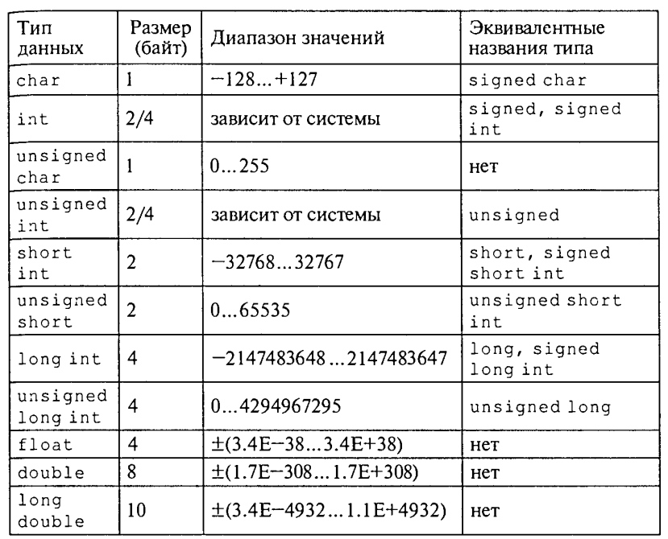

Типы данных
-----------

В Си++ имеется четыре базовых арифметических (число­вых) типа данных. Из них два целочисленных — **char**, **int** — и два плавающих (вещественных) — **float** и **double**. Также, в
программах можно использовать некоторые модификации этих ти­пов, описываемых с помощью служебных слов — модификаторов: 
* Модификаторы размера — **short** (короткий) и **long** (длинный)
* Модификатора знаков — **signed** (знаковый) и **unsigned** (беззнаковый). Знаковые модификаторы при­
меняются только к целым типам.
Ранее упоминалось,что тип величины связан с ее формой внутреннего представления, множеством принимаемых значений и множеством операций, применимых к этой величине.

**Схема типов данных**

.. figure:: 02_type_diag.png
       :scale: 100 %
       :align: center
       :alt: asda

**Арифметические типы данных Си++**

Описание переменных
"""""""""""""""""""
Программа оперирует информацией, представленной в виде различных объектов и величин. Переменная – это символическое обозначение величины в программе. Значение   переменной (или величина, которую она обозначает) во время выполнения программы может изменяться.
С точки зрения архитектуры компьютера, переменная – это символическое обозначение ячейки оперативной памяти программы, в которой хранятся данные. Содержимое этой ячейки – это текущее значение переменной.
В языке Си++ прежде чем использовать переменную, ее необходимо оописать.
**Синтакис:**
*имя_типа список_переменных;*

**Примеры описаний:**

**char** symbol,сс;
**unsigned char** code;
**int** number,row;
**unsigned long** long_number;
**float** x,X,cc3;
**double** e,b4;
**long double** max_num;

Тип переменной определяет, какие возможные значения эта переменнаяможет принимать и какие операции можно выполнять над данной переменной. Тип переменной изменить нельзя.

**Инициализация переменных**
Вместе с описанием можно присвоить значение

::

	float pi=3.14159,с=1.23;
	unsigned int year=2000;

Константы
"""""""""

Запись целых констант
~~~~~~~~~~~~~~~~~~~~~

*Целые десятичные числа* начинающиеся не с нуля, например: 4, 356, —128.
*Целые восьмеричные числа*, запись которых начинается с нуля, например: 016, 077.
*Целые шестнадцатеричные числа*, запись которых начинается с символов Ох, например: OxlA, 0x253, OxFFFF.

Запись вещественных констант
~~~~~~~~~~~~~~~~~~~~~~~~~~~~
Если в записи числовой кон­станты присутствует десятичная точка (2.5) или экспоненциаль­ное расширение (1Е-8), то компилятор рассматривает ее как ве­щественное число и ставит ей в соответствие тип **double**.
Приме­ры вещественных констант: 44.0 3.14159 44Е0 1.5Е-4.

Использование суффиксов
~~~~~~~~~~~~~~~~~~~~~~~
Программист может явно задать тип константы, используя для этого суффиксы. Существуют три вида
суффиксов: F ( f ) - float ; U(u) - unsigned ; L ( l ) - long (для целых и вещественных констант). Допускается совместное использование суффиксов U и L в вариантах UL или LU.

Примеры: 
3,14159F — константа типа floaf , под которую выделяется 4 байта памяти;
3,14L — константа типа long double, занимает 10 байт;
50000U — константа типа unsigned i n t , занимает 2 байта памяти (вместо четырех без суффикса);
0LU — константа типа unsigned long, занимает 4 байта;
24242424UL — константа типа unsigned long, занимает 4 байта.

Запись символьных и строковых констант
~~~~~~~~~~~~~~~~~~~~~~~~~~~~~~~~~~~~~~
Символьные констан­ты заключаются в апострофы. 
Например: ' А ' , ' а ' , ' 5 ' , ' + '. 
Стро­ковые константы, представляющие собой *символьные последова­тельности*, заключаются в двойные кавычки. Например: "rezult", "введите исходные данные".

**Управляющие символы** 
Их назначение — управление выводом на экран. Как известно, такие символы расположены в начальной части кодовой таблицы ASCII (коды от 0 до 31) и неимеют графического представления. В программе на Си они изоб­ражаются парой символов, первый из которых '\' . Вот некото­рые из управляющих символов:

`'\n'` — переход на новую строку;
`'\t'` — горизонтальная табуляция;
`'\а'` — подача звукового сигнала.

Именованные константы
~~~~~~~~~~~~~~~~~~~~~

Для их определения используется служебное слово **const** принято называть **квалификатором доступа**. Квалификатор const указывает на то, что данная величина не может изменяться в течение всего времени работы программы. В частно­сти, она не может располагаться в левой части оператора присва­ивания. Примеры описания константных переменных:

::

	const float pi=3.14159;
	const int iMIN=l, iMAX=1000;

Определение констант на стадии препроцессорной обработки
~~~~~~~~~~~~~~~~~~~~~~~~~~~~~~~~~~~~~~~~~~~~~~~~~~~~~~~~

Препроцессорная директива **#define**
:Директива **#define**: определяет идентификатор и последовательность символов, которой будет замещаться данный идентификатор при его обнаружении в тексте программы. Идентификатор так­же называется именем макроса, а процесс замещения называется подстановкой макроса. Стандар­тный вид директивы следующий:

::

	#define имя_макроса последовательность_символов

Например:

::

	#define iMIN l
	#define iMAX 1000

Тип констант явно не указывается и определяется по форме записи. В конце директивы **не ставится** *точка с запятой.*

Идентификаторы *iMAX* и *iMIN* не требуют описания внутри программы

Перечисляемые константы
~~~~~~~~~~~~~~~~~~~~~~~

Данное средство языка по­зволяет определять последовательность целочисленных именован­ных констант.
Описание перечисляемого типа начинается со слу­жебного слова enum, а последующий список констант заключает­ ся в фигурные скобки. Например:

::
	
	enum { A , B , C , D };

В результате имени А будет сопоставлена константа 0, имени B — константа 1, C — 2, D — з. По умолчанию значение первой константы равно нулю. 
Для любой константы можно явно указать значение. Например:

::

	enum {A=10, B, C, D};

В результате будут установлены следующие соответствия: А=10, B=11, C=12, D=13
Возможен и такой вариант определения перечисления:

::

	enum {A=10,B=20,C=35,D=100};
Если перечисляемому типу дать имя, то его можно использо­вать в описании переменных. 
На­пример:

::
	
	enum metal {Fe,Co,Na,Cu,Zn};
	metal Met1,Met2;

Здесь идентификатор **metal** становится именем типа. После такого описания в программе возможны следующие операторы:

::
	
	Met1=Na;
	Met2=Zn;

	
	
	
	
	
	
	
	
