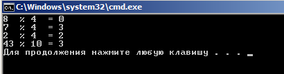

--------------------
Операции и выражения
--------------------

:Выражение: Конструкция, составленная из констант, переменных, знаков, операций, функций, скобок. Выражение определяет порядок вычис­ления некоторого значения. Если это числовое значение, то такое выражение называют **арифметическим**.

=======================
Арифметические операции
=======================

C++ существуют следующие арифметические операции:
* + — сложение;
* - — вычитание;
* * — умножение;
* / — деление ;
* % — остаток от деления.
* ++ унарная операция увеличения на единицу (инкремент);
* -- унарная операция уменьшения на единицу (декремент).

Все операции, кроме деления по модулю, применимы к лю­бым числовым типам данных. Операция **%** применима только к целым числам.

При делении (/), если делимое и делитель — целые числа, то и результат — целое число.
Если хотя бы один из операндов имеет вещественный тип, то и результат будет вещественным. Например, операции 5./3, 5.0/3.0 , 5/3.0 дадут вещественный результат 1.6666

**Приоритет операций**

* ++, --
* - (унарный минус)
* *, / %
* +, -

Ниже представлен программный код использующий арифметические операции в C++.

::

	#include <iostream>
	#include<clocale>
	#include<iomanip>
	using namespace std;
	 
	int main()
	{
	    setlocale(LC_CTYPE,"rus");
		double sum, razn, umnozh, div; // объявление переменных через запятую
	    double a1; // отдельное объявление переменной a1
	    double a2; // отдельное объявление переменной a2
	    cout << "Введите первое число: ";
	    cin >> a1;
	    cout << "Введите второе число: ";
	    cin >> a2;
	    sum  = a1 + a2;  // операция сложения
	    razn = a1 - a2;  // операция вычитания
	    umnozh  = a1 * a2;  // операция умножения
	    div  = a1 / a2;  // операция деления
	    cout << a1 << "+" << a2 << "= " << sum  << endl;
	    cout << a1 << "-" << a2 << "= " << razn << endl;
	    cout << a1 << "*" << a2 << "= " << umnozh << endl;
	    cout << a1 << "/" << a2 << "= " <<fixed<<setprecision(3)<<div<< endl;
	    system ("pause");
	    return 0;
	}

Пример использования арифметической операции **%** — остаток от деления

::

	#include <iostream>
	using namespace std;
	 
	int main()
	{
	    cout << "8  % 4  = " << 8 % 4   << endl; // выполнение операции "остаток от деления"
	    cout << "7  % 4  = " << 7 % 4   << endl;
	    cout << "2  % 4  = " << 2 % 4   << endl;
	    cout << "43 % 10 = " << 43 % 10 << endl;
	    system("pause");
	    return 0;
	}

Результат:

	
==================
Операции отношения
==================

