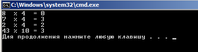

""""""""""""""""""""
Операции и выражения
""""""""""""""""""""

:Выражение: Конструкция, составленная из констант, переменных, знаков, операций, функций, скобок. Выражение определяет порядок вычис­ления некоторого значения. Если это числовое значение, то такое выражение называют **арифметическим**.

~~~~~~~~~~~~~~~~~~~~~~~
Арифметические операции
~~~~~~~~~~~~~~~~~~~~~~~

C++ существуют следующие арифметические операции:

* + — сложение;
* - — вычитание;
* * — умножение;
* / — деление ;
* % — остаток от деления
* ++ унарная операция увеличения на единицу (инкремент);
* -- унарная операция уменьшения на единицу (декремент).

Все операции, кроме деления по модулю, применимы к любым числовым типам данных. Операция **%** применима только к целым числам.

При делении (/), если делимое и делитель — целые числа, то и результат — целое число.
Если хотя бы один из операндов имеет вещественный тип, то и результат будет вещественным. Например, операции 5./3, 5.0/3.0 , 5/3.0 дадут вещественный результат 1.6666

**Приоритет операций**

* ++, --
* ``-`` (унарный минус)
* *, / %
* +, -

Ниже представлен программный код использующий арифметические операции в C++.

::

	#include <iostream>
	#include<clocale>
	#include<iomanip>
	using namespace std;
	 
	int main()
	{
	    setlocale(LC_CTYPE,"rus");
		double sum, razn, umnozh, div; // объявление переменных через запятую
	    double a1; // отдельное объявление переменной a1
	    double a2; // отдельное объявление переменной a2
	    cout << "Введите первое число: ";
	    cin >> a1;
	    cout << "Введите второе число: ";
	    cin >> a2;
	    sum  = a1 + a2;  // операция сложения
	    razn = a1 - a2;  // операция вычитания
	    umnozh  = a1 * a2;  // операция умножения
	    div  = a1 / a2;  // операция деления
	    cout << a1 << "+" << a2 << "= " << sum  << endl;
	    cout << a1 << "-" << a2 << "= " << razn << endl;
	    cout << a1 << "*" << a2 << "= " << umnozh << endl;
	    cout << a1 << "/" << a2 << "= " <<fixed<<setprecision(3)<<div<< endl;
	    system ("pause");
	    return 0;
	}

Пример использования арифметической операции **%** — остаток от деления

::

	#include <iostream>
	using namespace std;
	 
	int main()
	{
	    cout << "8  % 4  = " << 8 % 4   << endl; // выполнение операции "остаток от деления"
	    cout << "7  % 4  = " << 7 % 4   << endl;
	    cout << "2  % 4  = " << 2 % 4   << endl;
	    cout << "43 % 10 = " << 43 % 10 << endl;
	    system("pause");
	    return 0;
	}

Результат:


       
~~~~~~~~~~~~~~~~~~
Операции отношения
~~~~~~~~~~~~~~~~~~

* < меньше
* <= меньше или равно,
* > больше
* >= больше или равно
* = равно,
* !=не равно.

В стандарте Си нет логического типа данных. Поэтому результатом операции отношения является целое число: если отношение истинно — то 1, если ложно — то 0.

Примеры отношений:

а<0, 101>=105, 'а'=='А' 'а'!='А'

Результатом второго и третьего отношений будет 0 — ложь; результат четвертого отношения равен 1 — истина; результат пер­вого отношения зависит от значения переменной а.

~~~~~~~~~~~~~~~~~~~
Логические операции
~~~~~~~~~~~~~~~~~~~

* ! операция отрицания (НЕ),
* && конъюнкция, логическое умножение (И),
* || дизъюнкция, логическое сложение (ИЛИ).

Например, логическое выражение, соответствующее системе неравенств 0 <х< 1 в программе на Си++ запишется в виде следую­щего логического выражения:

::

	х>0 && х<1

~~~~~~~~~~~~~~~~~~~~~
Операция присваивания
~~~~~~~~~~~~~~~~~~~~~
Знак операции присваивания **=**. 

Присваивание, как любой другой знак операции, может несколько раз входить в выражение. 
На­пример:

::

	а=b=с=х+у;

Присваивание имеет самый низкий приоритет (ниже только у операции «запятая»). Кроме того, операция присваивания — правоассоциативная. Это значит, что несколько подряд расположен­ных присваиваний выполняются справа налево. Поэтому в приве­денном выше выражении первой выполнится операция сложе­ния, затем переменной **с** присвоится значение суммы, затем это значение присвоится переменной **b** и в конце — переменной **а**.

В языке Си имеются дополнительные операции присваивания, совмещающие присваивание с выполнением других операций. Среди них: 

* +=, - = , /=, *=, %=. 

Приоритет у них такой же, как и у простого присваивания. Примеры использования этих операций:

* а+=2 эквивалентно а=а+2,
* х-=a+b эквивалентно х=х-(а+Ь),
* р/=10 эквивалентно р=р/10,
* ```m*=n``` эквивалентно m=m*n,
* r%=5 эквивалентно r=r%5.

.. note:: Вместо выражения а=а+2 предпочтительнее пи­сать в программе а+=2, поскольку второе выражение будет вы­числяться быстрее.0

~~~~~~~~~~~~~~~~~~~~~~~~~~~~~~~~~~~~~~~~~
Приведение типов при вычислении выражений.
~~~~~~~~~~~~~~~~~~~~~~~~~~~~~~~~~~~~~~~~~ 

В языках программирования высокого уровня работает ряд об­щих правил записи выражений:

* все символы, составляющие выражение, записываются в стро­ку (нет надстрочных и подстрочных символов);
* в выражении проставляются все знаки операций;
* при записи выражения учитываются приоритеты операций;
* для влияния на последовательность операций используются круглые скобки.

В процессе вычисления выражений с разнотипными операнда­ми производится автоматическое преобразование типов величин:

* преобразование не выполняется, если оба операнда имеют одинаковый тип;
* при разных типах операндов происходит приведение величи­ны с младшим типом к старшему типу (кроме операции присваи­вания);
* при выполнении операции присваивания величина, полу­ченная в правой части, преобразуется к типу переменной, сто­ящей слева от знака =.

Старшинство типов друг по отношению к другу определяется по следующему принципу: старший тип включает в себя все зна­чения младшего типа как подмножество. Вещественные (плаваю­щие) типы являются старшими по отношению к целым.

Целые типы повозрастанию старшинства расположены в таком порядке:

char—>shot->int—>long

Порядок старшинства вещественных типов следующий:

float->double—>long double


