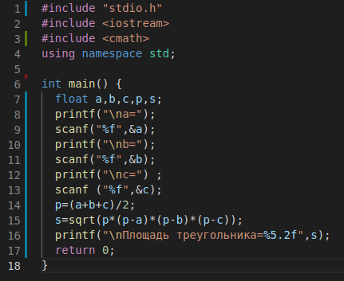
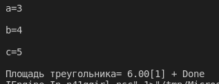
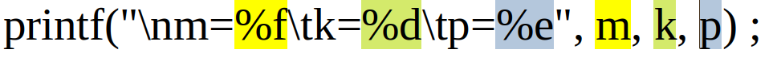

Форматированный ввод и вывод на экран
-------------------------------------

Cтандартная библиотека ввода-вывода Си **stdio. h**. 

В этой библиотеке определены в качестве объектов стандартные символь­ные потоки со следующими именами:

* **printf** — форматированный **вывод**;
* **scanf** —  форматированный **ввод** с клавиатуры.

Вывод данных
~~~~~~~~~~~~~~~

Синтаксис команды

::

	printf(форматная_строка, список_аргументов);
	
Форматная строка ограничена двойными кавычками (текстовая константа) и может включать в себя произвольный текст, управляющие символы и спецификаторы формата. Список аргументов может отсутствовать или же состоять из выраже­ний, значения которых выводятся на экран (в частном случае из констант и переменных).

       
На рисунке в строке 8 оператор printf ("\na=") ; содержит текст ("а=") и управляющий символ ("\n"). Текст выводится на экран в том виде, в котором он записан. Управляющие символы влияют на рас­положение на экране выводимых знаков. В результате выполненияэтого оператора на экран с новой строки выведутся символы а=.

Признаком управляющего символа является значок **\**. 

**Управляющие символы:**

\n — перевод строки;
\t — горизонтальная табуляция;
\r — возврат курсора к началу новой строки;
\а — сигнал-звонок;
\Ь — возврат на один символ (одну позицию);
\f — перевод (прогон) страницы;
\v — вертикальная табуляция.

Оператор в строке 16 **printf ("\nПлощадь треугольника=%5.2f", s);** содержит все виды параметров функции *printf*. Список аргументов состоит из одной переменной **s**. Ее значение выводится на экран. 

Пара символов **%f** является спецификацией формата выводимого значения переменной **s**. Значок **%** — признак формата, а буква **f** указывает на то, что выводимое число имеет *вещественный (пла­вающий)* тип и выводится на экран в форме с фиксированной точкой. 

К спецификатору формата могут быть добавлены числовые пара­метры: **ширина поля** и **точность**. **Ширина** — это число позиций, отводимых на экране под величину, а **точность** — число позиций под
дробную часть (после точки). Параметры записываются между знач­ком **%** и символом формата и отделяются друг от друга точкой (в примере 5.2, 5 - ширина, 2 - количество знаков после запятой)

       
Спецификатор формата определяет форму внешнего представ­ления выводимой величины. 

Cпецификаторы формата:

* %с — символ;
* %s — строка;
* %d — целое десятичное число (тип int);
* %u — целое десятичное число без знака (тип unsigned);
* %f — вещественные числа в форме с фиксированной точкой;
* %е — вещественные числа в форме с плавающей точкой (с мантиссой и порядком).

Например, после выполнения следующих операторов:

::

	float m;
	float p;
	int k ;
	m=84.3; 
	k=-12; 
	p=32.15;
	printf("\nm=%f\tk=%d\tp=%e",m,k,p) ;

На экран выведется строка:

::

	m=84.299999	k=-12	p=3.21500e+01
	
Здесь дважды используемый управляющий символ табуляции **\t** отделил друг от друга выводимые значения. 

.. note: Соответствие между спецификаторами формата и эле­ментами списка аргументов устанавливается в порядке их записи слева направо.

       

       
       

