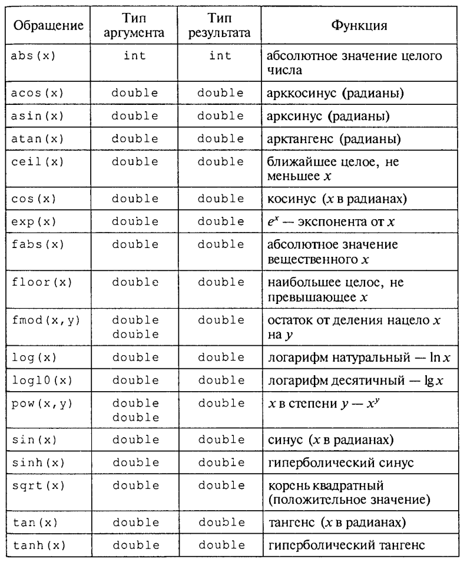

Структура программы
--------------------

Общая структура программы на Си++ следующая:

::

	#include <директива_препроцессора_1>
	#include <директива_препроцессора_2>
	...
	определение_функции_1
	определение_функции_2
	...
	определение_функции_n

	void main()
	{
		определения_объектов;
		исполняемые_операторы;
	}

Пример:

Дано: а, Ь, с — стороны треугольника. Вычислить S — площадь треугольника. По формуле Герона:

.. math::

	S = $\sqrt{2}$

Листинг "Площадь треугольника"

::

	#include<iostream>
	#include<cmath>
	#include<iomanip>
	
	using namespace std;
	
	int main()
	{
		// Описание переменных	
		float a,b,c,S,p;
		
		//Запрос данных
		cout<<"Введите значения сторон треугольника"<<endl;
		
		//Ввод данных
		cin>>a>>b>>c;
		
		//Вычисление полупериметра
		p=(a+b+c)/2;
		
		//Вычисление площади
		S=sqrt(p*(p-a)*(p-b)*(p-c));
		//---------Вывод результата в консоль-------------
		cout<<"Площадь треугольника: "<<fixed<<setprecision(2)<<S<<endl;
	}

**Комментарии:**
**main** - главная функция со стандартным именем.

**void** обозначает отсутствие какого-либо возвращаемого этой функцией результата, а пустые скобки — отсутствие у нее аргументов. 

Все, что следует после заголовка функции и заключе­но в фигурные скобки, можно назвать телом функции. Первая строка — объявление используемых переменных. Все они плаваю­щего типа **double**. Обратите внимание на то, что объявление пе­ременных заканчивается **точкой с запятой**.

Дальнейшая часть программы — исполняемые операторы. Понятие «оператор» в Си трактуется следующим образом: любое выражение, после которого стоит точка с запятой, вос­принимается компилятором как отдельный оператор. 

*Оператор определяет законченное действие на очередном шаге выполнения программы*.

С точки зрения данного выше определения следующая конструкция в программе является оператором:

**i++;**

Его называют *оператором-выражением*. Если вычисление выражения заканчивается присваиванием, то его можно назвать опера­тором присваивания. В рассматриваемой программе присутствуют два оператора присваивания: вычисления полупериметра (р) и вычисления площади треугольника (S).

В выражении для вычисления площади используется библио­течная функция **sqrt()** — квадратный корень.
Данная функция относится к библиотеке математических функ­ций. Для подключения этой библиотеки к нашей программе ис­пользуется директива препроцессора **#include <math.h>**.

Математические функции 
-------------------------

       
Потоковый ввод-вывод в Си++
--------------------------------

В Си++ имеются свои специфические средства ввода-вывода. Это библиотека классов, под­ключаемая к программе с помощью файла **iostream. h** . В этой библиотеке определены в качестве объектов стандартные символь­ные потоки со следующими именами:

* **cin** — стандартный поток **ввода** с клавиатуры;
* **cout** — стандартный поток **вывода** на экран.

Ввод данных
~~~~~~~~~~~~~~~

Интерпретируется как извлечение из потока cin и присваивание значений соответствующим переменным. В Си++ определена операция извлечения из стандартного потока, знак которой **>>**. 

Например, ввод значений в переменную **х** реализуется оператором

::

	cin>>x;

Вывод данных
~~~~~~~~~~~~~~~~

Интерпретируется как помещение в стандартный поток **cout** выводимых значений. Выводиться могут тексты, за­ключенные в двойные кавычки, и значения выражений. Знак операции помещения в поток **<<**. 

Примеры использования потокового вывода:

::
	
	cout<<a+b;
	соut<<"\nРезультат="<<y;
	cout<<"x=<<x<<" y="<<y<<" z=<<<<endl;

В выходном потоке можно использовать управляющие символы перед каждым элементом вывода нужно ста­вить знак операции **<<**. Элемент вывода **endl** является так называ­емым манипулятором, определяющим перевод курсора на новую строку (действует аналогично управляющему символу ``\n``).

В процессе потокового ввода-вывода происходит преобразо­вание из формы внешнего символьного представления во внут­ренний формат и обратно. Тип данных и необходимый формат определяются автоматически.

Стандартные форматы задаются специальными флагами форматирования, которые устанавлива­ются с помощью функции **setf()**

Подробнее про **setf()**
http://cppstudio.com/post/319/
https://intuit.ru/studies/courses/3479/721/lecture/25559

Практические занятия
--------------------

