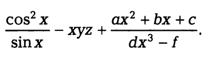

Практические занятия
--------------------

1. Вычислить значения по следующим формулам при действи­тельных значениях всех переменных:

.. figure:: pract/ex_01.png
       :scale: 100 %
       :align: center
   
2. Вычислить значения по следующим формулам при действи­тельных значениях всех переменных: 
   

          
3. Найти произведение цифр заданного четырехзначного числа.
4. Вычислить расстояние между двумя точками с заданными ко­ординатами (x1,y1) и (х2, у2).
5. Дана длина ребра куба. Найти площади грани, полной по­верхности и объем этого куба.
6. Перевести радианную меру угла в градусы, минуты и секун­ды. Решить обратную задачу.
7. Окружность вписана в квадрат с заданной площадью. Найти площадь квадрата, вписанного в эту окружность. Определить, во сколько раз площадь вписанного квадрата меньше площади задан­ного квадрата.
