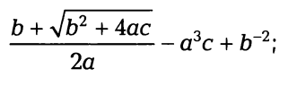
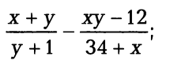

Задания для самостоятельной работы
----------------------------------

Задание №1
~~~~~~~~~~

Вычислить значение по следующим формулам при действительных значениях всех переменных

Задание №2
~~~~~~~~~~

Вычислить значение по следующим формулам при действительных значениях всех переменных

       

Задание №3
~~~~~~~~~~

Дана длина стороны равностороннего треугольника. 
Найти площадь этого треугольника, его высоту, радиусы вписанной и описанной окружностей.

Задание №4
~~~~~~~~~~

Три резистора Rl, R2, R3 соединены параллельно. Найти сопротивление соединения. 
Решить обратную задачу: по известному общему сопротивлению соединения и двум из трех сопротивлений резисторов, найти третье.

Задание №5
~~~~~~~~~~

Дано натуральное число Т, представляющее собой длительность прошедшего времени в секундах. Вывести это значение длительности в часах, минутах и секундах в следующей форме: НН ч ММ мин SS с.

