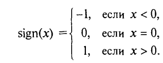
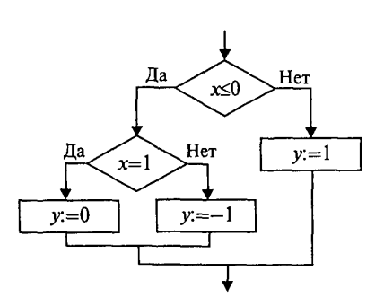
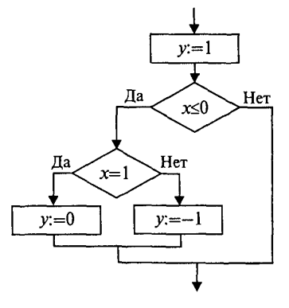
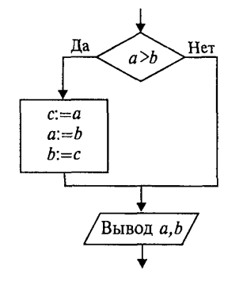

Для программирования ветвящихся алгоритмов в языке Си/Си++ имеется несколько различных средств:

* операция условия ?:
* условный оператор if 
* оператор выбора switch.

Условный оператор
-----------------

**Формат условного оператора:**

**if** (*выражение*) оператор1; **else** оператор2;

.. attention ::  выражение записывается в круглых скобках; точка с запятой после оператора 1 ставится обязательно.

Это полная форма оператора, программирующая структуру пол­ного ветвления. Обычно выражение — это некоторое условие, со­держащее операции отношения и логические операции. Значение выражения приводится к целому и интерпретируется в соответ­ствии с правилом: равно нулю — ложь, не равно нулю — истина.

Если выражение истинно, выполняется оператор1, если ложно — оператор2.

Возможно использование неполной формы условного опера­тора:

if (выражение) оператор;
Пример использования полной формы условного операто­ра для нахождения большего значения из двух переменных а и b:

::

	if(a>b) 
	{
		max=a; 
	}
	else 
	{
		max=b;
	}	

Примеры программирования вложенных ветвящихся структур. 
~~~~~~~~~~~~~~~~~~~~~~~~~~~~~~~~~~~~~~~~~~~~~~~~~~~~~~~

Требуется вычислить функцию sign(x) — знак х,которая определена следующим образом:

       
Пример 1. Алгоритм с полными вложенными ветвлениями:

::

	if(х<=0)
		if(x==0)
			y=0;
		else
			у=-1;
	else
		у=1;

Пример 2. Алгоритм с полными вложенными ветвлениями:

::

	y = 1;
	if (x<=0)
		if(x==0)
			y=0;
		else
			y=-1

Пример 3. Упорядочить по возрастанию значения в двух пере­менных а, b

::

	y = 1;
	if (x<=0)
		if(x==0)
			y=0;
		else
			y=-1

Общая структура программы на Си++ следующая:

::

	if(a>b)
	{
		с=а;
		a=b;
		b=c;
	}
	cout<<"a="<<a<<"b="<<b;

В данном примере использован составной оператор — последо­вательность операторов, заключенная в фигурные скобки. В Си фигурные скобки выполняют роль операторных скобок

Пример 4. Вычислить площадь теугольника по заданным сторонам. Выполнить проверку сторон:

* величины сторон - положительные значения;
* сумма длин каждой пары сторон тре­угольника должна быть больше длины третьей стороны.

::

	// Площадь треугольника
	#include <iostream>
	#include <cmath>
	#include<stdio.h>
	using namespace std;

	int main()
	{
	    float a,b,c,p,s;
	    cout<<"\na=";
	    cin>>a;
	    cout<<"\nb="; 
	    cin>>b;
	    cout<<"\nc="; 
	    cin>>c;
	    if(a>0 && b>0 && c>0 && a+b>c && a+c>b && b+c>a)
	    { 
		p=(a+b+c)/2;
		s=sqrt(p*(p-a)*(p-b)*(p-c));
		//Вывод результата (потоковый вывод)
		cout<<"\nПлощадь треугольника = "<<s<<endl;
		//Вывод результата (форматированный вывод)
		printf("\nПлощадь треугольника=%5.2f\n",s);
	    }
	    else
	    {
		cout<<"\n Неверные исходные данные."<<endl;
	    }
	    return 0;
	}

Результат (1 тест):

::

	a=4.5
	b=6.7
	c=8.9
	Площадь треугольника = 14.6589
	Площадь треугольника=14.66

Результат (2 тест):

::

	a=3
	b=4
	c=9
	Неверные исходные данные.

