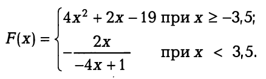

Практические занятия
--------------------

1. Даны три действительных числа. Возвести в квадрат неотри­цательные из этих чисел и в четвертую степень —отрицатель­ные
2. Даны целые числа t, n. Если эти числа не равны, заменить меньшее из них большим исходных числом, а если равны, то за­менить оба исходных числа нулями.    
3. Определить, пройдет ли график функции :math:`a^2 + b^2 = c^2` че­рез заданную точку с координатами (m,n).
4. Дан круг с радиусом R. Определить, поместится ли правиль­ный треугольник со стороной a в этом круге.
5. В небоскребе N этажей и всего один подъезд. На каждом этаже по три квартиры. Лифт может останавливаться только на нечетных этажах. Человек входит в кабину лифта и набирает но­мер необходимой ему квартиры М. Определить, на какой этаж лифт должен доставить пассажира?
6. Два прямоугольника, расположенные в первом квадранте, со сторонами, параллельными осям координат, заданы координа­ тами своих левого верхнего и правого нижнего углов. Для первого прямоугольника это точки с координатами (х1,y1) и (х2, 0), для вто­рого — (х3, у3), (х4, 0). Определить, пересекаются ли данные прямоугольники, и вычислить площадь их общей части, если они пе­ресекаются.
7. Дана точка А(х, у). Определить, принадлежит ли она тре­угольнику с вершинами, имеющими координаты (x1,y1), (x2,y2), (х3, y3)
8. Вычислить значение функции:

   
9. Составить программу, которая по введенному номеру дня недели выводит его название.
