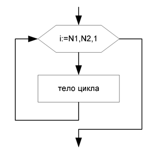

Цикл FOR
~~~~~~~~~~~~~~

Этот вид оператора цикла называют **цикл со счетчиком** или **цикл с параметром**. В нем важную роль играет **переменная-параметр**, которая на каждом шаге цикла автоматически изменяет свое значение обычно на единицу - поэтому ее называют **счетчиком**.

::

        for (int i=start_value;i<=end_value;i++)
        {
                //cycle body
        }

Если тело цикла представлено одиночным оператором, то **{** и **}** можно не писать.

На блок - схеме цикл с параметром удобно представлять следующим образом:

Инструкции между  **{** и **}** выполняются столько раз, сколько определяет выражение 

::

        (end_value - start_value) + 1

Это соответствует всем значением счетчика от начального до конечного включительно.

Если start_value > end_value , то инструкции  между  **{** и **}**  не выполняются ни разу.

Пример:

::

        for (i=1;i<=14;i++) cout<<i<<" ";

Выведет на экран последовательность цифр в виде:

::

        10 11 12 13 14

Особенности использования:
""""""""""""""""""""""""""""""

* оператор for используется для организации циклов с фиксированным, заранее известным или определяемым во время выполнения программы числом повторений;
* **количество повторений** цикла определяется начальным и конечным значением счетчика. Оператор for обеспечивает выполнение тела цикла до тех пор, пока не будут перебраны все значения параметра цикла от начального до конечного;
* переменная-счетчик должна быть порядкового типа (обычно - **int**)
* начальное и конечное значение параметра цикла могут быть константами, переменными, выражениями и должны принадлежать одному и тому же типу данных. Начальное и конечное знначения параметра цикла **нельзя менять во время выполнения цикла**;
* после нормального завершенияоператора for значение параметра цикла равно конечному значению. Если оператор не выполнялся, то значение параметра не определено;
* если изменение параметра не равно 1, то предпочтительнее использовать *while* или *do while*.

Оператор break
""""""""""""""

Для досрочного выхода из цикла можн использовать оператор break:

::

        for (str='e';str>='a';str--)
        {
                cout<<str<<" ";
                if (str=='b') break;
        }

Оператор continue 
""""""""""""""""""

Если выполнение очередного шага цикла требуется завершить до того, как будет достигнут конец тела цикла, используется оператор continue. 

Следующий фрагмент программы обеспечивает вывод на экран всех четных чисел в диапазоне от 1 до 100.

::

        for (int i=l; i<=100; i++)
        {
                if (i%2) continue; 
                cout<<\t<<i; 
        }

**Комментарий:**

Для нечетных значений переменной *i* остаток от деления на 2 будет равен единице, этот результат воспринимается как значение «истина» в условии ветвления, и выполняется оператор continue. Он завершит очередной шаг цикла, выполнение цикла
перейдет к следующему шагу

Пример:
""""""""""""

Программа "Тест по таблице умножения" задает ученику 5 вопросов и в конце тестирования выставляет оценку по 5-балльной шкале

Листинг:

.. code-block:: cpp

        #include <iostream>
        #include <ctime>
        using namespace std;
         
         int main()
        {
                int s1,s2,otvet;
                int kol=0,prav=0;
                srand(time(0)); // автоматическая  рандомизация генератора случайных чисел
                for (int=1; i<=5; i++)//количество заданных вопросов 
                { 
                        s1=2+rand() % 19;// Случайное число от 1 до 19
                        s2=2+rand() % 19;// Случайное число от 1 до 19
                        cout<<"Сколько будет "<<s1<<" * "<<s2<<"?: ";
                        cin>>otvet; //считывается ответ пользователя
                        if (otvet==s1*s2) // если ответ совпадает с результатом s1*s2...
                        {
                                cout<<"Вы ответили правильно"<<endl; //., то хвалим пользователя и ...
                                prav++;//в случае правильного ответа переменная prav увелич на 1
                        } 
                        else 
                        {
                                cout<<"Вы ответили неправильно"<<endl; 
                        }
                        
                } //если значение i не превысило 5, то выполняем все снова начиная с (*)

                cout<<"Правильных ответов: "<<prav<<endl;
                cout<<float(prav)/float(kol)*100<<"% правильных ответов: "<<endl;
                system("pause");
        }

