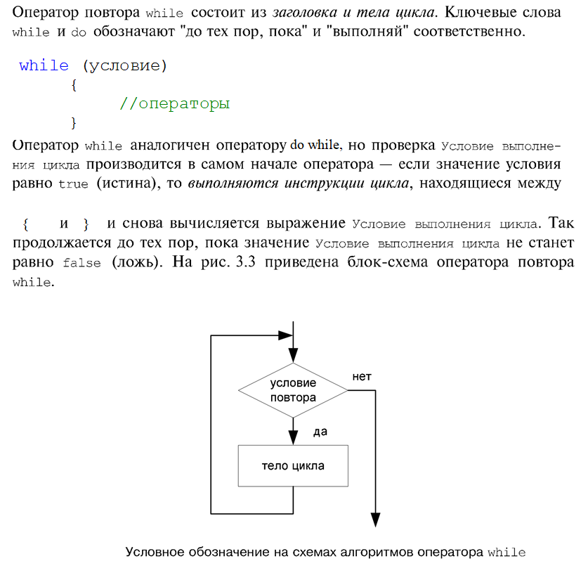

Цикл с предусловием WHILE
~~~~~~~~~~~~~~~~~~~~~~~~~~~~

Этот вид оператора цикла называют **цикл с предусловием**.

.. code-block:: cpp

        #include <iostream>
        using namespace std;
        int main()
        {
                int i=0;
                while (i<=10)
                { //(*)
                        cout<<i<<" ";
                        i++;
                }
                cout<<endl;
                i=10;
                while (i>=1)
                { //(*)
                        cout<<i<<" ";
                        i--;
                }
                cout<<endl;
                system("pause");
        }

   
  
