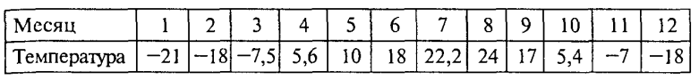

Линейные массивы
~~~~~~~~~~~~~~~~

В повседневной и научной практике часто приходится встречаться с информацией, представленной в табличной форме. Например, таблица, содержащая среднемесячные значения тем­пературы, °С, за определенный год:

Такую таблицу называют *линейной*. Она представляет собой пос­ледовательность упорядоченных чисел. Если требуется какая-то ма­тематическая обработка этих данных, то для их обозначения обычно вводят индексную символику. Например, через :math:`T_1`, обозначается температура января (первого месяца), :math:`Т_5` — температура мая и т.д. В общем виде множество значений, содержащихся в таблице, обо­значается так:

.. math::

	\{ T_i \}, i = 1..12

Можно создать массив фамилий "S" учеников класса. Значением элемента массива будет фамилия ученика, а индексом - порядковый номер по списку. Пусть дан список фамилий учеников и их оценки: 

С массивом связаны следующие его свойства: имя, тип, раз­мерность, размер.

**Формат описания массива:**

тип_элементов имя[константное выражение]

Так же как и таблица, массив представляет собой совокупность про­нумерованных однотипных значений, имеющих общее имя. Эле­менты массива обозначаются переменными с индексами. **Индексы** - это порядковые номера элементов (0, 1,...,5...). Индек­сы записывают в квадратных скобках после имени массива. Индексированные величины удобно использовать для записи их математической обработки.

Константное выражение определяет размер массива, т. е. числе элементов этого массива. Например, согласно описанию 

::

	int A[10]; 
	
объявлен массив с именем А, содержащий 10 элементов целого типа. Элементы массива обозначаются индексированными имена­ми. 

.. attention:: В Си нижнее значение индекса равно 0 

А[0], А[8], А[1], А[9] А[2], А[3], А[4], А[5], А[6], А[7]

Описание массива определяет, во-первых, размещение масси­ва в памяти, во-вторых, правила его дальнейшего употребления в программе. Последовательные элементы массива располагаются в последовательных ячейках памяти (A[0], A[1] и т.д.), причем значения индекса не должны выходить из диапазона 0..9. В качестве индекса может употребляться любое выражение соответствующе­го типа.

В Си нельзя определять произвольные диапазоны для индексов. Размер массива, указанный в описа­нии, всегда на единицу больше максимального значения ин­декса. Размер массива может явно не указываться, если при его объявлении производится инициализация значений элементов. 

Например: 

::

	int p[]={2, 4, б, 10, 1}; 
	
В этом случае создается массив из пяти элементов со следую­ щими значениями: р[0]=2, р[1]=4, р[2]=б, р[3]=10, р[4]=1 

В результате следующего объявления массива 

::

	int М[6]={5, 3, 2}; 
	
будет создан массив из шести элементов. Первые три элемента получат инициализированные значения. Значения остальных бу­дут либо неопределенными, либо равны нулю, если массив вне­шний или статический. Рассмотрим несколько примеров программ обработки одно­мерных массивов. Если известна зависимость, по которой изменяются значения элементов массива, то присвоение значений удобно проводить в операторах цикла c параметром или с условием.

**Пример 1**: Ввод с клавиатуры и вывод на экран одномерного массива из 5 элементов:

.. code-block:: cpp

	#include <iostream>
	using namespace std;

	int main()
	{ 
	    //Описание массива
	    int A [5];
	    
	    //Ввод элементов массива
	    for (int i = 0; i < 5;i++)
	    { 
		cout<<"A["<<i<<"]=";
		cin>>A[i];
	    }
	    
	    //Вывод массива
	    for (int i=0 ;i<5;i++)
		cout<<"A["<<i<<"]="<<A[i]<<endl;
	    return 0;		
	}

**Пример 1.1**: Заполнить массив с помощью инициализации списком и вывести удвоенные значения элементов массива:

.. code-block:: cpp

	#include <iostream>
	using namespace std;
	
	int main()
	{ 
	    int len; //размер массива;
		int A[]={2,-4,5,8,0,9};
        
	    //Вычисление длины массива (количества элементов)
		len=sizeof(A)/sizeof(A[0]);
		//sizeof(A) - вычисление размера массива в байтах
		//sizeof(A[0]) - вычисление размера одной ячейки в байтах
		
		//Вывод массива
		for (int i=0 ;i<len;i++)
			cout<<"A["<<i<<"]="<<2*A[i]<<endl;
		return 0;
		
	}

**Пример 2**: Ввод с клавиатуры и вычисление среднего арифметического одномерного массива из n элементов (n - константа):

.. code-block:: cpp

	#include <iostream>
	using namespace std;

	int main()
	{ 
	    const int n=5; //константа, задающая количество элементов массива
	    int A[n];  //Массив из n элементов
	    double SA; //Среднее арифметическое
	    int SUM=0;   //Сумма элементов массива
	    //Ввод элементов массива
	    for (int i = 0; i < n;i++){ 
		cout<<"A["<<i<<"]=";		//Запрос элемента массива
		cin>>A[i];			//Считывание значения с клавиатуры
		SUM=SUM+A[i];			//Добавление считанного значения к сумме элементов
	    }
	    SA=SUM/double(n);			//вычисление среднего арифметического
	    					//для получения вещественного значения приводим значение n к типу double
	    cout<<SA<<endl;			
	}
	
2 способ

.. code-block:: cpp

	#include <iostream>
	using namespace std;
	int main()
	{
		//Описание массива
		int len; //размер массива;
		int A[]={2,-4,5,8,0,9,4,-3,5,7,1,-12};
		double SA; //Среднее арифметическое
		int SUM=0;   //Сумма элементов массива

		//Вычисление длины массива (количества элементов)
		len=sizeof(A)/sizeof(A[0]);

		//подсчет суммы
		for (int i = 0; i < len;i++)
		{
				SUM=SUM+A[i];
		}
		
		//вычисление среднего арифметического
		SA=SUM/double(len);   
		cout<<"Среднее арифметическое = "<<SA<<endl;
		
		//Вывод массива
		for (int i=0 ;i<len;i++)
			cout<<"A["<<i<<"]="<<A[i]<<endl;
		return 0;
	}

Генератор случайных чисел
"""""""""""""""""""""""""

Случайные числа в языке программирования С++ могут быть сгенерированы функцией **rand()** из стандартной библиотеки С++. Функция **rand()** генерирует числа в диапазоне от 0 до RAND_MAX. RAND_MAX — это константа, определённая в библиотеке <cstdlib>

Формула генерации случайных чисел по заданному диапазону: 

.. code-block:: cpp

	random_number = firs_value + rand() % last_value;

где *firs_value* - минимальное число из желаемого диапазона
*last_value* - ширина выборки

Например, случайное число от 1 до 10: random_number = 1 + rand() % 10;

**Функция srand()**

Функция srand() получив целый положительный аргумент типа unsigned или unsigned int (без знаковое целое) выполняет рандомизацию, таким образом, чтобы при каждом запуске программы функция srand() генерировала случайные числа.

Чтобы производить рандомизацию автоматически,не меняя каждый раз аргумент в функции srand() нужно воспользоваться функцией time() с аргументом 0.
	
Автоматическая рандомизация

::

	srand( time(0) );

Чтобы использовать функцию time(), необходимо подключить заголовочный файл <ctime>.

**Пример 3**: Заполнить одномерный (линейный) массив с помощью датчика случайных чисел значениями от 10 до 99 и найти в нем минимальный элемент

.. code-block:: cpp

	#include <iostream>
	#include <ctime>
	using namespace std;

	int main()
	{ 
	    const int n=10; 	//константа, задающая количество элементов массива
	    int A[n];  	//Массив из n элементов
	    int min=1000; 	//минимальное значение. Изначально инициализируется значением, превыщающим любое из возможных в массиве
	    int index_min; 	//индекс srand( time( 0 ) ля минимального элемента
	    srand(time(0));
	    //Генерация элементов элементов массива
	    for (int i = 0; i < n;i++){ 
		    A[i]=10 + rand() % 90;	//Генерация элемента массива
	    }
	    //Вывод массива
	    for (int i = 0; i < n;i++){ 
		    cout<<A[i]<<" ";
	    }
	    cout<<endl;
	    //Поиск минимального элемента
	    for (int i = 0; i < n;i++){ 
	    	if (A[i]<min)
		{
		        min=A[i];       //Переопределяем минимум
		        index_min=i;    //"Запоминаем" номер элемента
		}
	    }
	    cout<<"Минимальное значение A["<<index_min<<"]="<<min<<endl;
	}

Если известна зависимость, по которой изменяются значения элементов массива, то присвоение значений удобно проводить в операторах цикла c параметром или с условием. Например, присвоим значения элементам массива "y" по зависимости: y=sin(x), где x=Pi*i/180, 0<=i<=180.

.. code-block:: cpp

	const double pi=3.14;
	double y[200];
	for (i=0;i<=180;i++){
		y[i]:=(pi*i)/180.0;
	}
  

