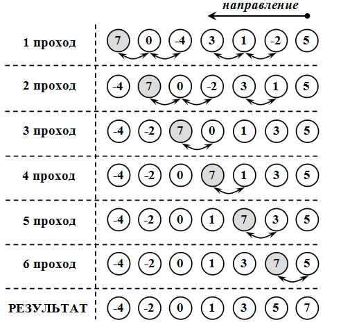

Линейные массивы
~~~~~~~~~~~~~~~~

В повседневной и научной практике часто приходится встречаться с информацией, представленной в табличной форме. Например, таблица, содержащая среднемесячные значения тем­пературы, °С, за определенный год:

.. figure:: img/temper.png
	:align: center
	:scale: 100%

Такую таблицу называют *линейной*. Она представляет собой пос­ледовательность упорядоченных чисел. Если требуется какая-то ма­тематическая обработка этих данных, то для их обозначения обычно вводят индексную символику. Например, через :math:`T_1`, обозначается температура января (первого месяца), :math:`Т_5` — температура мая и т.д. В общем виде множество значений, содержащихся в таблице, обо­значается так:

.. math::

	\{ T_i \}, i = 1..12

Можно создать массив фамилий "S" учеников класса. Значением элемента массива будет фамилия ученика, а индексом - порядковый номер по списку. Пусть дан список фамилий учеников и их оценки: 

.. figure:: img/student.png
	:align: center
	:scale: 100%

С массивом связаны следующие его свойства: имя, тип, раз­мерность, размер.

**Формат описания массива:**

тип_элементов имя[константное выражение]

Так же как и таблица, массив представляет собой совокупность про­нумерованных однотипных значений, имеющих общее имя. Эле­менты массива обозначаются переменными с индексами. **Индексы** - это порядковые номера элементов (0, 1,...,5...). Индек­сы записывают в квадратных скобках после имени массива. Индексированные величины удобно использовать для записи их математической обработки.

Константное выражение определяет размер массива, т. е. числе элементов этого массива. Например, согласно описанию 

::

	int A[10]; 
	
объявлен массив с именем А, содержащий 10 элементов целого типа. Элементы массива обозначаются индексированными имена­ми. 

.. attention:: В Си нижнее значение индекса равно 0 

А[0], А[8], А[1], А[9] А[2], А[3], А[4], А[5], А[6], А[7]

Описание массива определяет, во-первых, размещение масси­ва в памяти, во-вторых, правила его дальнейшего употребления в программе. Последовательные элементы массива располагаются в последовательных ячейках памяти (A[0], A[1] и т.д.), причем значения индекса не должны выходить из диапазона 0..9. В качестве индекса может употребляться любое выражение соответствующе­го типа.

В Си нельзя определять произвольные диапазоны для индексов. Размер массива, указанный в описа­нии, всегда на единицу больше максимального значения ин­декса. Размер массива может явно не указываться, если при его объявлении производится инициализация значений элементов. 

Например: 

::

	int p[]={2, 4, б, 10, 1}; 
	
В этом случае создается массив из пяти элементов со следую­ щими значениями: р[0]=2, р[1]=4, р[2]=б, р[3]=10, р[4]=1 

В результате следующего объявления массива 

::

	int М[6]={5, 3, 2}; 
	
будет создан массив из шести элементов. Первые три элемента получат инициализированные значения. Значения остальных бу­дут либо неопределенными, либо равны нулю, если массив вне­шний или статический. Рассмотрим несколько примеров программ обработки одно­мерных массивов. Если известна зависимость, по которой изменяются значения элементов массива, то присвоение значений удобно проводить в операторах цикла c параметром или с условием.

**Пример 1**: Ввод с клавиатуры и вывод на экран одномерного массива из 5 элементов:

.. code-block:: cpp

	#include <iostream>
	using namespace std;

	int main()
	{ 
	    //Описание массива
	    int A [5];
	    
	    //Ввод элементов массива
	    for (int i = 0; i < 5;i++)
	    { 
		cout<<"A["<<i<<"]=";
		cin>>A[i];
	    }
	    
	    //Вывод массива
	    for (int i=0 ;i<5;i++)
		cout<<"A["<<i<<"]="<<A[i]<<endl;
	    return 0;		
	}

**Пример 2**: Ввод с клавиатуры и вычисление среднего арифметического одномерного массива из n элементов (n - константа):

.. code-block:: cpp

	#include <iostream>
	using namespace std;

	int main()
	{ 
	    const int n=5; //константа, задающая количество элементов массива
	    int A[n];  //Массив из n элементов
	    double SA; //Среднее арифметическое
	    int SUM=0;   //Сумма элементов массива
	    //Ввод элементов массива
	    for (int i = 0; i < n;i++){ 
		cout<<"A["<<i<<"]=";		//Запрос элемента массива
		cin>>A[i];			//Считывание значения с клавиатуры
		SUM=SUM+A[i];			//Добавление считанного значения к сумме элементов
	    }
	    SA=SUM/double(n);			//вычисление среднего арифметического
	    					//для получения вещественного значения приводим значение n к типу double
	    cout<<SA<<endl;			
	}

Генератор случайных чисел
"""""""""""""""""""""""""

Случайные числа в языке программирования С++ могут быть сгенерированы функцией **rand()** из стандартной библиотеки С++. Функция **rand()** генерирует числа в диапазоне от 0 до RAND_MAX. RAND_MAX — это константа, определённая в библиотеке <cstdlib>

Формула генерации случайных чисел по заданному диапазону: 

.. code-block:: cpp

	random_number = firs_value + rand() % last_value;

где *firs_value* - минимальное число из желаемого диапазона
*last_value* - ширина выборки

Например, случайное число от 1 до 10: random_number = 1 + rand() % 10;

**Функция srand()**

Функция srand() получив целый положительный аргумент типа unsigned или unsigned int (без знаковое целое) выполняет рандомизацию, таким образом, чтобы при каждом запуске программы функция srand() генерировала случайные числа.

Чтобы производить рандомизацию автоматически,не меняя каждый раз аргумент в функции srand() нужно воспользоваться функцией time() с аргументом 0.
	
Автоматическая рандомизация

::

	srand( time(0) );

Чтобы использовать функцию time(), необходимо подключить заголовочный файл <ctime>.

**Пример 3**: Заполнить одномерный (линейный) массив с помощью датчика случайных чисел значениями от 10 до 99 и найти в нем минимальный элемент

.. code-block:: cpp

	#include <iostream>
	#include <ctime>
	using namespace std;

	int main()
	{ 
	    const int n=10; 	//константа, задающая количество элементов массива
	    int A[n];  	//Массив из n элементов
	    int min=1000; 	//минимальное значение. Изначально инициализируется значением, превыщающим любое из возможных в массиве
	    int index_min; 	//индекс srand( time( 0 ) ля минимального элемента
	    srand(time(0));
	    //Генерация элементов элементов массива
	    for (int i = 0; i < n;i++){ 
		    A[i]=10 + rand() % 90;	//Генерация элемента массива
	    }
	    //Вывод массива
	    for (int i = 0; i < n;i++){ 
		    cout<<A[i]<<" ";
	    }
	    cout<<endl;
	    //Поиск минимального элемента
	    for (int i = 0; i < n;i++){ 
	    	if (A[i]<min)
		{
		        min=A[i];       //Переопределяем минимум
		        index_min=i;    //"Запоминаем" номер элемента
		}
	    }
	    cout<<"Минимальное значение A["<<index_min<<"]="<<min<<endl;
	}

Если известна зависимость, по которой изменяются значения элементов массива, то присвоение значений удобно проводить в операторах цикла c параметром или с условием. Например, присвоим значения элементам массива "y" по зависимости: y=sin(x), где x=Pi*i/180, 0<=i<=180.

.. code-block:: cpp

	const double pi=3.14;
	double y[200];
	for (i=0;i<=180;i++){
		y[i]:=(pi*i)/180.0;
	}
  
Сортировка массива
"""""""""""""""""""

https://academy.yandex.ru/posts/osnovnye-vidy-sortirovok-i-primery-ikh-realizatsii

https://infostart.ru/1c/articles/204320/

Задача сортировки является такой же базовой, как задача поиска. В практических условиях эти задачи взаимосвязаны. 

В общем случае сортировку следует понимать как процесс перегруппировки заданного множества объектов в определенном порядке. Часто при сортировке больших объемов данных нецелесообразно переставлять сами элементы, поэтому для решения задачи выполняется упорядочивание элементов по индексам. То есть индексы элементов выстраивают в такой последовательности, что соответствующие им значения элементов оказываются отсортированными по условию задачи.

Сортировка применяется для облегчения поиска элементов в упорядоченном множестве. Задача сортировки одна из фундаментных в программировании.

Сортировка – это упорядочивание набора однотипных данных по возрастанию или убыванию.

Чаще всего при сортировке данных лишь часть их используется в качестве ключа сортировки. Ключ сортировки – это часть данных, определяющая порядок элементов. Таким образом, ключ участвует в сравнениях, но при обмене элементов происходит перемещение всей структуры данных. Например, в списке почтовой рассылки в качестве ключа может использоваться почтовый индекс, но сортируется весь адрес. При решении задач сортировок массивов ключ и данные совпадают.

Для того, чтобы отсортировать данные, можно вызывать стандартную функцию **qsort()**, входящую в библиотеку С++. Однако различные подходы к сортировке обладают разными характеристиками. Несмотря на то, что некоторые способы сортировки могут быть в среднем лучше, чем другие, ни один алгоритм не является идеальным для всех случаев. Использование функции qsort() не является универсальным решением для всех задач сортировки.

Оценка алгоритмов сортировки
''''''''''''''''''''''''''''

Существует множество различных алгоритмов сортировки. Все они имеют свои положительные и отрицательные стороны. Перечислим общие критерии оценки алгоритмов сортировки.

* Скорость работы алгоритма сортировки. Она непосредственно связана с количеством сравнений и количеством обменов, происходящих во время сортировки, причем обмены занимают больше времени. Сравнение происходит тогда, когда один элемент массива сравнивается с другим; обмен происходит тогда, когда два элемента меняются местами. Время работы одних алгоритмов сортировки растет экспоненциально, а время работы других логарифмически зависит от количества элементов.
* Время работы в лучшем и худшем случаях. Оно имеет значение при анализе выполнения алгоритма, если одна из краевых ситуаций будет встречаться довольно часто. Алгоритм сортировки зачастую имеет хорошее среднее время выполнения, но в худшем случае он работает очень медленно.
* Поведение алгоритма сортировки. Поведение алгоритма сортировки называется естественным, если время сортировки минимально для уже упорядоченного списка элементов, увеличивается по мере возрастания степени неупорядоченности списка и максимально, когда элементы списка расположены в обратном порядке. Объем работы алгоритма оценивается количеством производимых сравнений и обменов.

Различные сортировки массивов отличаются по быстродействию. Существуют простые методы сортировок, которые требуют порядка n*n сравнений, где n – количество элементов массива и быстрые сортировки, которые требуют порядка n*ln(n) сравнений. Простые методы удобны для объяснения принципов сортировок, т.к. имеют простые и короткие алгоритмы. Усложненные методы требуют меньшего числа операций, но сами операции более сложные, поэтому для небольших массивов простые методы более эффективны.

Простые методы сортировки можно разделить на три основные категории:

* сортировка методом "пузырька" (простого обмена);
* сортировка методом простого выбора (простой перебор);
* сортировка методом простого включения (сдвиг-вставка, вставками, вставка и сдвиг).

Сортировка методом "пузырька" (простого обмена)
'''''''''''''''''''''''''''''''''''''''''''''''''''''''

Самый известный алгоритм – пузырьковая сортировка (bubble sort, сортировка методом пузырька или просто сортировка пузырьком). 

Алгоритм попарного сравнения элементов массива в литературе часто называют "методом пузырька", проводя аналогию с пузырьком, поднимающимся со дна бокала с газированной водой. По мере всплывания пузырек сталкивается с другими пузырьками и, сливаясь с ними, увеличивается в объеме. Чтобы аналогия стала очевидной, нужно считать, что элементы массива расположены вертикально друг над другом, и их нужно так упорядочить, чтобы они увеличивались сверху вниз.

Алгоритм состоит в повторяющихся проходах по сортируемому массиву. За каждый проход элементы последовательно сравниваются попарно и, если порядок в паре неверный, выполняется обмен элементов. Проходы по массиву повторяются до тех пор, пока на очередном проходе не окажется, что обмены больше не нужны, что означает – массив отсортирован. При проходе алгоритма элемент, стоящий не на своём месте, "всплывает" до нужной позиции

.. code-block:: cpp

	//Описание функции сортировки методом "пузырька"
	void BubbleSort (int k,int x[max]) {
	  int i,j,buf;
	  for (i=k-1;i>0;i--)
	    for (j=0;j<i;j++)
	    if (x[j]>x[j+1]) {
	      buf=x[j];
	      x[j]=x[j+1];
	      x[j+1]=buf;
	     }    
	}

В пузырьковой сортировке количество сравнений всегда одно и то же, поскольку два цикла for повторяются указанное количество раз независимо от того, был список изначально упорядочен или нет. Это значит, что алгоритм пузырьковой сортировки всегда выполняет :math:`\frac{(n^2-n)}{2}` сравнений, где n – количество сортируемых элементов. Данная формула выведена на том основании, что внешний цикл выполняется n-1 раз, а внутренний выполняется в среднем n/2 раз.

Пузырьковая сортировка имеет такую особенность: неупорядоченные элементы на "большом" конце массива занимают правильные положения за один проход, но неупорядоченные элементы в начале массива поднимаются на свои места очень медленно.

**Пример 4**: Отсортировать по возрастанию одномерный массив из примера 3 методом "пузырька"

.. code-block:: cpp

	#include <iostream>
	#include <ctime>
	using namespace std;

	int main()
	{ 
	    const int n=10; 	//константа, задающая количество элементов массива
	    int A[n];  	//Массив из n элементов
	    int min=1000; 	//минимальное значение. Изначально инициализируется значением, превыщающим любое из возможных в массиве
	    int index_min; 	//индекс srand( time( 0 ) ля минимального элемента
            bool flag=true;
            int temp;		//переменная для обмена данными
            srand(time(0));
	   
            //Генерация элементов элементов массива
            //...
            
            //Вывод неотсортированного массива
            //..
            
            //Сортировка массива
            for (int i = 0; i < n-1;i++){ 
                for (int j = 0; j < n-i-1;j++)
                {
                    if (A[j]>A[j+1])
                    {
                        temp=A[j];
                        A[j]=A[j+1];
                        A[j+1]=temp;
                    }
                }
            }
            
            //Вывод отсортированного массива
            cout<<"Sorted array"<<endl;
            for (int i = 0; i < n;i++){ 
                cout<<A[i]<<" ";
            }
        cout<<endl;  
	}

