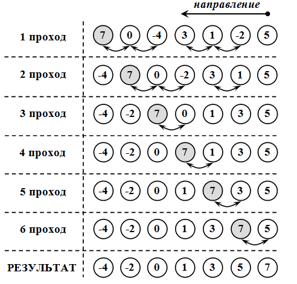

Сортировка массива
~~~~~~~~~~~~~~~~~~~~~~

Задача сортировки является такой же базовой, как задача поиска. В практических условиях эти задачи взаимосвязаны. 

Cортировку следует понимать как процесс перегруппировки заданного множества объектов в определенном порядке. Часто при сортировке больших объемов данных нецелесообразно переставлять сами элементы, поэтому для решения задачи выполняется упорядочивание элементов по индексам. То есть индексы элементов выстраивают в такой последовательности, что соответствующие им значения элементов оказываются отсортированными по условию задачи.

Сортировка применяется для облегчения поиска элементов в упорядоченном множестве. **Задача сортировки одна из фундаментных в программировании.**

**Сортировка** – это упорядочивание набора однотипных данных по возрастанию или убыванию.

Чаще всего при сортировке данных лишь часть их используется в качестве ключа сортировки. Ключ сортировки – это часть данных, определяющая порядок элементов. Таким образом, ключ участвует в сравнениях, но при обмене элементов происходит перемещение всей структуры данных. Например, в списке почтовой рассылки в качестве ключа может использоваться почтовый индекс, но сортируется весь адрес. При решении задач сортировок массивов ключ и данные совпадают.

Для того, чтобы отсортировать данные, можно вызывать стандартную функцию **qsort()**, входящую в библиотеку С++. Однако различные подходы к сортировке обладают разными характеристиками. Несмотря на то, что некоторые способы сортировки могут быть в среднем лучше, чем другие, ни один алгоритм не является идеальным для всех случаев.

Использование функции **qsort()** не является универсальным решением для всех задач сортировки. Во-первых, функцию общего назначения, такую как **qsort()**, невозможно применить во всех ситуациях. Например, данная функция сортирует только массивы в памяти и не может сортировать данные, хранящиеся в связанных списках. Во-вторых, qsort() – параметризованная функция, благодаря чему она может обрабатывать широкий набор типов данных, но вследствие этого она работает медленнее, чем эквивалентная функция, рассчитанная на какой-то один тип данных. В-третьих, алгоритм быстрой сортировки, примененный в функции **qsort()**, может оказаться не самым эффективным алгоритмом в некоторых конкретных ситуациях.

Оценка алгоритмов сортировки
''''''''''''''''''''''''''''

Существует множество различных алгоритмов сортировки. Все они имеют свои положительные и отрицательные стороны. Перечислим общие критерии оценки алгоритмов сортировки.

* Скорость работы алгоритма сортировки. Она непосредственно связана с количеством сравнений и количеством обменов, происходящих во время сортировки, причем обмены занимают больше времени. Сравнение происходит тогда, когда один элемент массива сравнивается с другим; обмен происходит тогда, когда два элемента меняются местами. Время работы одних алгоритмов сортировки растет экспоненциально, а время работы других логарифмически зависит от количества элементов.
* Время работы в лучшем и худшем случаях. Оно имеет значение при анализе выполнения алгоритма, если одна из краевых ситуаций будет встречаться довольно часто. Алгоритм сортировки зачастую имеет хорошее среднее время выполнения, но в худшем случае он работает очень медленно.
* Поведение алгоритма сортировки. Поведение алгоритма сортировки называется естественным, если время сортировки минимально для уже упорядоченного списка элементов, увеличивается по мере возрастания степени неупорядоченности списка и максимально, когда элементы списка расположены в обратном порядке. Объем работы алгоритма оценивается количеством производимых сравнений и обменов.

Различные сортировки массивов отличаются по быстродействию. Существуют простые методы сортировок, которые требуют порядка n*n сравнений, где n – количество элементов массива и быстрые сортировки, которые требуют порядка n*ln(n) сравнений. Простые методы удобны для объяснения принципов сортировок, т.к. имеют простые и короткие алгоритмы. Усложненные методы требуют меньшего числа операций, но сами операции более сложные, поэтому для небольших массивов простые методы более эффективны.

Простые методы сортировки можно разделить на три основные категории:

* сортировка методом "пузырька" (простого обмена);
* сортировка методом простого выбора (простой перебор);
* сортировка методом простого включения (сдвиг-вставка, вставками, вставка и сдвиг).

Сортировка методом "пузырька" (простого обмена)
'''''''''''''''''''''''''''''''''''''''''''''''''''''''

Самый известный алгоритм – пузырьковая сортировка (bubble sort, сортировка методом пузырька или просто сортировка пузырьком). 

Алгоритм попарного сравнения элементов массива в литературе часто называют "методом пузырька", проводя аналогию с пузырьком, поднимающимся со дна бокала с газированной водой. По мере всплывания пузырек сталкивается с другими пузырьками и, сливаясь с ними, увеличивается в объеме. Чтобы аналогия стала очевидной, нужно считать, что элементы массива расположены вертикально друг над другом, и их нужно так упорядочить, чтобы они увеличивались сверху вниз.

Алгоритм состоит в повторяющихся проходах по сортируемому массиву. За каждый проход элементы последовательно сравниваются попарно и, если порядок в паре неверный, выполняется обмен элементов. Проходы по массиву повторяются до тех пор, пока на очередном проходе не окажется, что обмены больше не нужны, что означает – массив отсортирован. При проходе алгоритма элемент, стоящий не на своём месте, "всплывает" до нужной позиции

.. code-block:: cpp

	//Описание функции сортировки методом "пузырька"
	void BubbleSort (int k,int x[max]) {
	  int i,j,buf;
	  for (i=k-1;i>0;i--)
	    for (j=0;j<i;j++)
	    if (x[j]>x[j+1]) {
	      buf=x[j];
	      x[j]=x[j+1];
	      x[j+1]=buf;
	     }    
	}

В пузырьковой сортировке количество сравнений всегда одно и то же, поскольку два цикла for повторяются указанное количество раз независимо от того, был список изначально упорядочен или нет. Это значит, что алгоритм пузырьковой сортировки всегда выполняет :math:`\frac{(n^2-n)}{2}` сравнений, где n – количество сортируемых элементов. Данная формула выведена на том основании, что внешний цикл выполняется n-1 раз, а внутренний выполняется в среднем n/2 раз.

Пузырьковая сортировка имеет такую особенность: неупорядоченные элементы на "большом" конце массива занимают правильные положения за один проход, но неупорядоченные элементы в начале массива поднимаются на свои места очень медленно.

**Пример 4**: Отсортировать по возрастанию одномерный массив из примера 3 методом "пузырька"

.. code-block:: cpp

	#include <iostream>
	#include <ctime>
	using namespace std;

	int main()
	{ 
	    const int n=10; 	//константа, задающая количество элементов массива
	    int A[n];  	//Массив из n элементов
	    int min=1000; 	//минимальное значение. Изначально инициализируется значением, превыщающим любое из возможных в массиве
	    int index_min; 	//индекс srand( time( 0 ) ля минимального элемента
            bool flag=true;
            int temp;		//переменная для обмена данными
            srand(time(0));
	   
            //Генерация элементов элементов массива
            //...
            
            //Вывод неотсортированного массива
            //..
            
            //Сортировка массива
            for (int i = 0; i < n-1;i++){ 
                for (int j = 0; j < n-i-1;j++)
                {
                    if (A[j]>A[j+1])
                    {
                        temp=A[j];
                        A[j]=A[j+1];
                        A[j+1]=temp;
                    }
                }
            }
            
            //Вывод отсортированного массива
            cout<<"Sorted array"<<endl;
            for (int i = 0; i < n;i++){ 
                cout<<A[i]<<" ";
            }
        cout<<endl;  
	}

