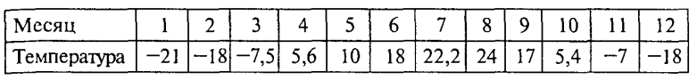

Линейные массивы
~~~~~~~~~~~~~~~~

В повседневной и научной практике часто приходится встречаться с информацией, представленной в табличной форме. Например, таблица, содержащая среднемесячные значения тем­пературы, °С, за определенный год:

Формат определения функции
""""""""""""""""""""""""""""""

Формат определения функции следующий: 

*тип* **имя_функции** *(спецификация_параметров) *
{
	**тело_ функции**
} 

*Тип функции* — это тип возвращаемого функцией результата. Если функция не возвращает никакого результата, то для нее ука­зывается тип **void**. 

*Имя функции* — идентификатор, задаваемый программистом или **main** для основной функции. 

*Спецификации параметров* — это либо «пусто», либо список имен формальных параметров функции с указанием типа для каждого из них. 

*Тело функции* — это либо составной оператор, либо блок. Признаком блока является наличие описаний программных объектов (пере­менных, массивов и т.д.), которые действуют в пределах этого блока. Блок, как и составной оператор, ограничивается фигурны­ми скобками. 

.. note::В Си действует правило: тело функции не может содержать в себе определения других функций. Иначе говоря, недопустимы внут­ренние функции. 

Из всякой функции возможно обращение к другим функциям, однако они всегда яв­ляются внешними по отношению к вызывающей. Оператором возврата из функции в точку ее вызова является опе­ратор **return**. Он может использоваться в функциях в двух формах: 

**return;** или **return выражение;**

В первом случае функция не возвращает никакого значения в ка­честве своего результата. Во втором случае результатом функции яв­ляется значение указанного выражения. Тип этого выражения дол­жен либо совпадать с типом функции, либо относиться к числу ти­пов, допускающих автоматическое преобразование к типу функции. Оператор **return** может в явном виде отсутствовать в теле фун­кции. В таком случае его присутствие подразумевается перед зак­рывающей тело функции фигурной скобкой. Такая подстановка производится компилятором. 

Формат обращения к функции (вызова функции) традици­онный: 

имя_функции(список_фактических_праметров) 

Обращение к функции — это выражение. В этом выражении круг­лые скобки играют роль знака операции, для которой функция и фактические параметры (аргументы) являются операндами. Приори­тет операции «скобки» самый высокий, поэтому вычис­ление функции в выражениях производится раньше других операций.

Между формальными и фактическими параметрами при вызо­ве функции должны соблюдаться правила соответствия *по после­довательности* и *по типам*. 

Фактический параметр — это выраже­ние того же типа, что и у соответствующего ему формального параметра. Необходимо строго следовать принципу соот­ветствия типов. 

.. attention:: Передача параметров при вызове функции происхо­дит только по значению. В Си допустимы только параметры-значения. Поэтому выполнение функции не может изменить значения переменных, указанных в качестве фактических параметров. 

Прототип функции 
"""""""""""""""""

Прототипом называется предварительное описание функции, в котором содержатся все необходимые сведения для правильного обращения к ней: имя и тип функции, типы формальных параметров. В прототипе имена формальных параметров указывать необязательно, хотя их указание не является ошибочным. 

Полное определение функции **МАХ ()** перед основной частью программы необязательно. Вот другой вариант программы, решающей ту же самую задачу.

*Листинг maxproto.cpp*:

.. figure:: img/maxproto.png
	:align: center
	:scale: 100%
	
Мож­но было написать и так, как в заголовке определения функции: int MAX(int x, int у); 

.. attention:: Точка с запятой в конце прототипа ставится обязательно! 

Можно было бы записать прототип и в теле основной функции наряду с описаниями других программных объектов в ней. В

**Пример Функции03**:

Написать функцию, выводящую на экране строку, состоящую из 80 звездочек.

*Листинг: line.cpp* 

.. figure:: img/line.png
	:align: center
	:scale: 100%

	
В данной программе приводится пример использования функции, которая не имеет параметров и не возвращает никаких значений в точку вызова.

Использование библиотечных функций 
~~~~~~~~~~~~~~~~~~~~~~~~~~~~~~~~~~~

Библиотечными назы­ ваются вспомогательные функции, хранящиеся в отдельных фай­лах. Стандартные библиотеки входят в стандартный комплект си­стемы программирования на Си/Си++. Кроме того, программист может создавать собственные библиотеки функций. Для использования стандартных функций не­ обходимо подключать к программе заголовочные файлы соответ­ ствующих библиотек. Делается это с помощью директивы препроцессора **#include** с указанием имени заголовочного файла. Например, **#include<stdio.h>**. Эти файлы содержат прототипы функций библиотеки. На стадии препроцессора происходит подстановка прототипов перед основной функцией, после чего компилятор в состоянии контро­лировать правильность обращения к функциям. Сами программы, реализующие функции, хранятся в форме объектного кода и под­ключаются к основной программе на стадии редактирования свя­ ей (при работе компоновщика). 

**Пример Функции04**:

Составить программу для вычисления площади выпуклого четырехугольника по де­картовым координатам(рис. Функции01).

.. figure:: img/quadrilateral.png
	:align: center
	:scale: 100%
	:alt: "Рис. Функции01"

**Математическая модель:**

Обозначим координаты вершин четырехугольника так: (х1,у1), (х2,у2), (хЗ, у3), (х4, у4). Площадь четырехугольника можно вычислить как сумму площадей двух треугольников. В свою очередь, площадь каж­ дого треугольника вычисляется по формуле Герона.

.. figure:: img/geron.png
	:align: center
	:scale: 100%
	
Аналогично вычисляются дли­ны других отрезков. Таким образом, для решения основной задачи — вычисления площади четырехугольника — тре­буется вспомогательный алгоритм вычисления площади треугольни­ка  для которого, в свою очередь, необходим вспомогательный алгоритм вычисления длины отрез­ка по координатам концов.

*Листинг quadr.cpp*

.. figure:: img/quadr.png
	:align: center
	:scale: 100%

В этой программе используются функции из трех стандартных библиотек с заголовочными файлами **iostream**, **math.h**

Служебное слово **typedef** представляет собой спецификатор типа, позволяющий определять синонимы для обозначения ти­пов. В результате в рассматриваемой программе вместо длинного слова **double** для обозначения того же самого типа можно упот­реблять одну букву **D**. Данное описание действует глобально и рас­пространяется как на основную, так и навспомогательные функ­ции.

.. code-block:: cpp

	typedef double D;
	
В функции Geron имеются обращения к функции **Line**, а в основной функции — обращение только к функции **Geron**. 

.. attention::Для компилятора важно, чтобы перед вызывающей функцией присутствовал или прототип, или оп­ределение вызываемой функции. 

Поэтому если из данной програм­мы убрать прототип функции Line, то ошибки не будет. Но если одновременно с этим поменять местами определения функций **Line** и **Geron**, то компилятор выдаст сообщение об ошибке.

**Пример Функции05 (самостоятельно)**:

Составить программу для вычисления площади выпуклого пятиугольника по де­картовым координатам(рис. Функции02).

.. figure:: img/quadrilateral1.png
	:align: center
	:scale: 100%
	:alt: "Рис. Функции01"

Для реализации данной задачи достаточно в программе предыдущего примера **добавить** ввод координат пятой точки и вычисление площади третьего треугольника с помощью функций **Line** и **Geron**

