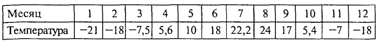

Двумерные массивы
~~~~~~~~~~~~~~~~~~~

В повседневной и научной практике часто приходится встречаться с информацией, представленной в табличной форме. Например, таблица, содержащая среднемесячные значения тем­пературы, °С, за определенный год:

Такую таблицу называют *линейной*. Она представляет собой пос­ледовательность упорядоченных чисел. Если требуется какая-то ма­тематическая обработка этих данных, то для их обозначения обычно вводят индексную символику. Например, через :math:`T_1`, обозначается температура января (первого месяца), :math:`Т_5` — температура мая и т.д. В общем виде множество значений, содержащихся в таблице, обо­значается так:

.. math::

	\{ T_i \}, i = 1..12

