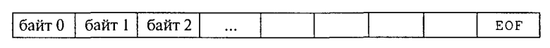

Потоковый ввод-вывод в стандарте Си (ФАЙЛЫ)
~~~~~~~~~~~~~~~~~~~~~~~~~~~~~~~~~~~~~~~~~~~~~~

Под вводом-выводом в программировании понимается процесс обмена информацией между оперативной памятью и внешними устройствами: клавиатурой, дисплеем, магнитными накопителя­ ми и т. п. 

Ввод — это занесение информации с внешних устройств в оперативную память, а вывод — вынос информации из опера­тивной памяти на внешние устройства. Такие устройства, как дис­плей и принтер, предназначены только для вывода; клавиатура — устройство ввода. Магнитные накопители (диски, ленты) исполь­зуются как для ввода, так и для вывода. Основным понятием, связанным с информацией на внешних устройствах ЭВМ, является понятие файла. Всякая операция вво­да-вывода трактуется как операция обмена с файлами: ввод — это чтение из файла в оперативную память; вывод — запись инфор­мации из оперативной памяти в файл. Поэтому вопрос об органи­зации в языке программирования ввода-вывода сводится к вопро­су об организации работы с файлами.

В языках Си/Си++ аналогом понятия внутреннего файла в яв­ляется понятие потока. Потоку в Си не ставится в соответствие тип. 

.. note:: Поток — это байтовая последовательность, передаваемая в про­цессе ввода-вывода. 

Поток должен быть связан с каким-либо внешним устройством или файлом на диске, то есть поток должен быть направлен на какое-то устройство или файл. Основные отличия файлов в Си состоят в следующем: здесь отсутствует понятие типа файла и, следовательно, фиксирован­ной структуры записи файла. Любой файл рассматривается как байтовая последовательность:

**EOF** стандартная константа — призна­к конца файла.

Стандартные потоки назначаются и открываются системой автоматически. С началом работы любой программы открываются 5 стандартных потоков, из которых ос­новными являются следующие:

* **stdin** — поток стандартного ввода (обычно связан с кла­виатурой);

* **stdout** — поток стандартного вывода (обычно связан с дисплеем);

* **stderr**— вывод сообщений об ошибках (связан с диспле­ем).

**Пример 1**: Ввод с клавиатуры и вывод на экран одномерного массива из 5 элементов:

.. code-block:: cpp

	#include <iostream>
	using namespace std;

	int main()
	{ 
	    //Описание массива
	    int A [5];
	    
	    //Ввод элементов массива
	    for (int i = 0; i < 5;i++)
	    { 
		cout<<"A["<<i<<"]=";
		cin>>A[i];
	    }
	    
	    //Вывод массива
	    for (int i=0 ;i<5;i++)
		cout<<"A["<<i<<"]="<<A[i]<<endl;
	    return 0;		
	}

