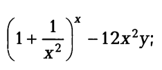

Задания для практической работы
--------------------------------

Пример №1 (ex_02_01.cpp)
'''''''''''''''''''''''''

Вычислить значение по следующим формулам при действительных значениях всех переменных.

Вычисление результата должно быть выполнено в функции result 

.. code-block:: cpp

	#include<iostream>
	//...

	double result(float x, float y)
	{
	  double f = 0;
	  //...
	  return f;
	}

	int main()
	{
	  return 0;
	}

:ref:`ex1201`

Пример №2 (ex_12_02.cpp)
''''''''''''''''''''''''''

Найти произведение цифр заданного четырехзначного числа. Вычисление результата должно быть выполнено в функции **calc_number**

**Спецификация функции calc_number:**

* Аргументы (вход): целое четырехзначное число (x)
* Выход: произведение цифр числа
* Пояснения: Для получения последней цифры получать остаток от деления числа на 10, после этого число переопределить путем получения целой части от деления на 10

.. code-block:: cpp

	#include<iostream>
	//...

	double calc_number(int x)
	{
	  int result = 1;
	  //...
	  return  result;
	}

	int main()
	{
	  return 0;
	}

:ref:`ex1202`

Пример №3 (ex_12_03.cpp)
''''''''''''''''''''''''

Вычислить расстояние между двумя точками с заданными координатами (x1,y1) и (х2, у2).

Вычисление результата должно быть выполнено в функции **point_distance**

**Спецификация функции point_distance:**

* Аргументы (вход): целочисленные значения координат точек x1, y1, x2, y2
* Выход: вещественное число  (double)
* Пояснения: используется теорема Пифагора

.. code-block:: cpp

	#include<iostream>
	//#include...

	double point_distance(int x1,int y1, int x2, int y2)
	{
	  double result=0;
	  //...
	  return result;
	}

	int main()
	{
	  return 0;
	}
	
:ref:`ex1203` 

Пример №4 (ex_12_04.cpp)
''''''''''''''''''''''''''''

Дана длина ребра куба. Найти площади грани, полной поверхности и объем этого куба. Вычисления должны быть выполнены в функциях:

* грань - cub_edge
* поверхность - cub_surf
* объем - cub_vol

**Спецификация функций:**

* Аргументы (вход): целочисленное значения длины ребра куба len
* Выход: вещественное число  (double)
* Пояснения: 

.. code-block:: cpp

	#include<iostream>
	//...

	double cub_edge(int len)
	{
	  double result = 0;
	  //...
	  return result;
	}

	double cub_surf(int len)
	{
	  double result = 0;
	  //...
	  return result;
	}

	double cub_vol(int len)
	{
	  double result = 0;
	  //...
	  return result;
	}

	int main()
	{
	  return 0;
	}

:ref:`ex1204`

Пример №5 (ex_12_05.cpp)
''''''''''''''''''''''''''''

**Задача**:
Составить программу вычисления корней квадратного уравнения ax^2+bx+c=0
Решение должно содержать 3 функции: discr,root_x1,root_x2

**Спецификация функций**:

discr:

* Назначение - вычисление дискриминанта
* Вход - вещественные коэффициенты квадратного уравнения (double a,double b,double c)
* Выход - вещественное значение дискриминанта

root_x1:

* Назначение - вычисление первого (единственного) корня
* Вход - вещественные коэффициенты квадратного уравнения и дискриминант (double a,double b,double d)
* Выход - вещественное значение первого (единственного) корня

root_x2:

* Назначение - вычисление второго корня
* Вход - вещественные коэффициенты квадратного уравнения и дискриминант (double a,double b,double d)
* Выход - вещественное значение второго корня

:ref:`ex1205`

Пример №6 (ex_12_06.cpp)
''''''''''''''''''''''''''''

**Задача:**

Составить программу нахождения точек пересечения графиков функций a1*x+b1*y+c1 =0 и a2*x+b2*y+c2 
Вычисление координат точек должно быть описано в функциях *intersect_koord_x*, *intersect_koord_y*

**Спецификация функций:**

*intersect_koord_y:*

* Назначение - вычисление координаты Y точки пересечения графиков линейных функций
* Вход - вещественные коэффициенты графиков функций (double a1,double b1,double c1,double a2,double b2,double c2)
* Выход - вещественное значение координаты Y
* Примечание: полученное значение подается на вход функции *intersect_koord_x*

*intersect_koord_x:*

* Назначение - вычисление координаты X точки пересечения графиков линейных функций
* Вход - вещественные коэффициенты графиков функций и вычисленная координата y (double a1,double b1,double c1,double y)
* Выход - вещественное значение координаты X

**Математическая модель:**

.. fugure:: img/ex_12_06_model.png
	:align: center
	:scale: 100%

