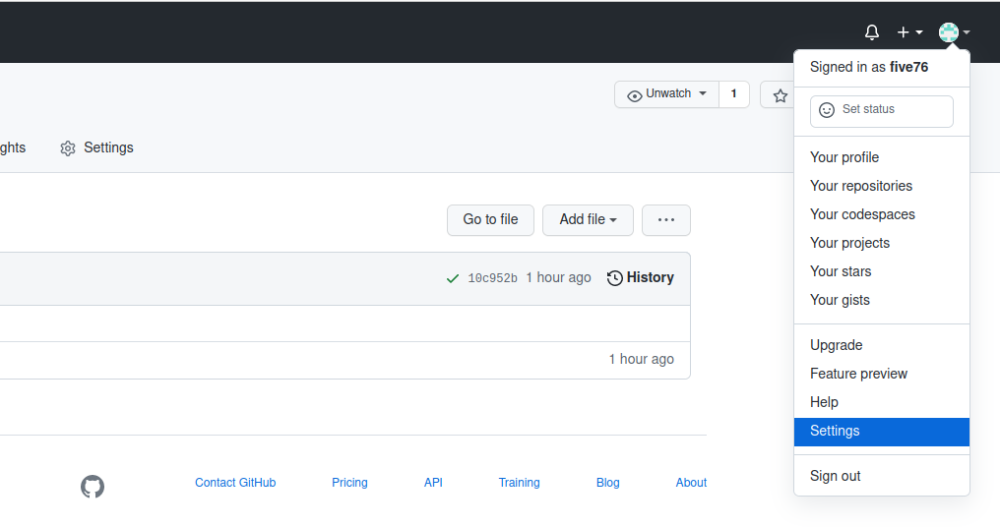
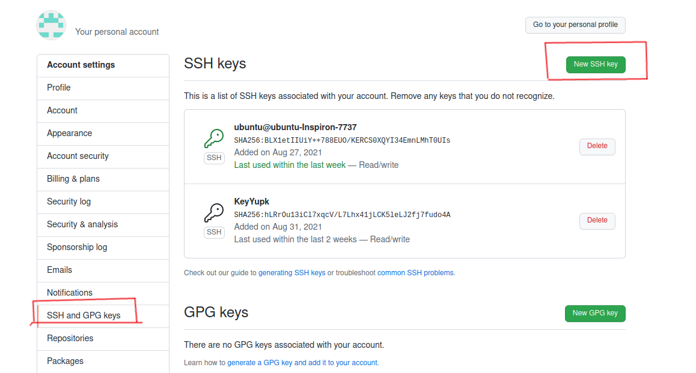
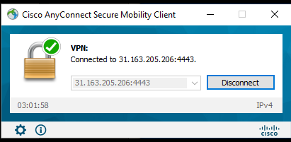
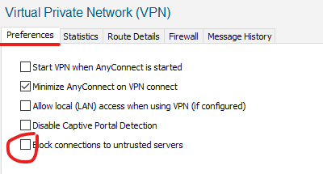

Подготовка
##########

Основы Git
==========

Git — это распределённая система контроля версий (Version Control System, VCS), которая широко используется и выпущена под лицензией GNU GPL v2. Она может:

* отслеживать изменения в файлах;
* хранить несколько версий одного файла;
* отменять внесённые изменения;
* регистрировать, кто и когда сделал изменения.

Git хранит изменения как снимок (snapshot) всего репозитория. Этот снимок выполняется после каждого коммита (commit).

Установка Git:
~~~~~~~~~~~~~

::

	$ sudo apt-get install git

Первичная настройка Git
~~~~~~~~~~~~~~~~~~~~~~~

Для начала работы с Git, необходимо указать имя и e-mail пользователя, которые будут использоваться для синхронизации локального репозитория с репозиторием на GitHub:

::

	$ git config --global user.name "username"
	$ git config --global user.email "username.user@example.com"
	
Посмотреть настройки Git можно таким образом:

::

	$ git config --list
	

Инициализация репозитория
~~~~~~~~~~~~~~~~~~~~~~~~~

Создание и переход в каталог **oapisip**

::

	cd ~
	mkdir -p oapisip/repo
	cd oapisip/repo

Инициализация репозитория выполняется с помощью команды **git init**:

::

	$ git init
	

Работа с Git
~~~~~~~~~~~~

Для управления Git используются различные команды, смысл которых поясняется далее.

git status
""""""""""

При работе с Git, важно понимать текущий статус репозитория. 
Для этого в Git есть команда **git status**

.. figure::git_status.png
       :scale: 100 %
       :align: center
       :alt: asda
       
Git сообщает, что мы находимся в ветке **master** (эта ветка создаётся сама и используется по умолчанию), и что ему нечего добавлять в коммит. Кроме этого, Git предлагает создать или скопировать файлы и после этого воспользоваться командой **git add**, чтобы Git начал за ними следить.

Создание файла README и добавление в него строки «test»

::

	$ touch README
	$ echo "test" >> README
	

После этого вывод **git status** выглядит таким образом:

.. figure::git_status2.png
       :scale: 100 %
       :align: center
       :alt: asda
       
Есть файл, за которым Git ещё не следит (Untracked)

git add
"""""""

Для того, чтобы Git начал следить за файлами, используется команда **git add**

Можно указать что надо следить за конкретным файлом

::

	$ git add README
	
Или за всеми файлами

::

	$ git add .
	
Вывод git status

.. figure::git_status2.png
       :scale: 100 %
       :align: center
       :alt: asda
       
Теперь файлы находятся в секции под названием «Changes to be committed».

git commit
""""""""""

После того, как все нужные файлы были добавлены в *staging*, можно закоммитить изменения. **Staging** — это совокупность файлов, которые будут добавлены в следующий **коммит** (фиксированное состояние). У команды **git commit** есть только один обязательный параметр – флаг **«-m»**. Он позволяет указать сообщение для этого коммита.

::

	$ git commit -m "First commit"

.. figure::git_commit.png
       :scale: 100 %
       :align: center
       :alt: asda
       
После этого git status отображает

.. figure::git_status3.png
       :scale: 100 %
       :align: center
       :alt: asda
       

Фраза «nothing to commit, working directory clean» обозначает, что нет изменений, которые нужно добавить в Git или закоммитить (зафиксировать).

Аутентификация на GitHub
~~~~~~~~~~~~~~~~~~~~~~~~

Для того, чтобы начать работать с GitHub, надо на нём зарегистрироваться. Для безопасной работы с GitHub лучше использовать аутентификацию по **ключам SSH**.

Генерация нового SSH-ключа 
""""""""""""""""""""""""""

(используйте e-mail, который привязан к GitHub):

::

	$ ssh-keygen -t rsa -b 4096 -C "github_email@gmail.com"

На всех вопросах достаточно нажать Enter (ключ с passphrase не используйте, для этого нужно нажать Enter при вопросе, тогда passphrase не будет запрашиваться у вас постоянно при операциях с репозиторием).

SSH-агент используется для хранения ключей в памяти и удобен тем, что нет необходимости вводить пароль passphrase каждый раз при взаимодействии с удаленным хостом (в данном случае - github.com).

Запуск SSH-агента (не используется на Windows):

::

	$ eval "$(ssh-agent -s)"

Добавить ключ в SSH-агент (пропускаем на Windows):

::

	$ ssh-add ~/.ssh/id_rsa

Добавление SSH-ключа на GitHub
""""""""""""""""""""""""""""""

Для добавления ключа надо его скопировать.

Например, таким образом можно отобразить ключ для копирования:

::
	
	$ cat ~/.ssh/id_rsa.pub

Выделить и скопировать (копировать полностью всю запись)

После копирования надо перейти на GitHub. Находясь на любой странице GitHub, в правом верхнем углу нажмите на картинку вашего профиля и в выпадающем списке выберите «Settings». 

В списке слева надо выбрать поле «SSH and GPG keys». После этого надо нажать «New SSH key» и в поле «Title» написать название ключа (например «Home»), а в поле «Key» вставить содержимое, которое было скопировано из файла ~/.ssh/id_rsa.pub.

.. note:: Если GitHub запросит пароль, введите пароль своего аккаунта на GitHub.

Чтобы проверить, всё ли прошло успешно, попробуйте выполнить команду 

::

	ssh -T git@github.com.

Вывод должен быть таким:

::
	$ ssh -T git@github.com
	Hi username! You've successfully authenticated, but GitHub does not provide shell access.

Теперь вы готовы работать с Git и GitHub.

Клонирование репозитория с GitHub
~~~~~~~~~~~~~~~~~~~~~~~~~~~~~~~~~

Для выполнения работ по курсу необходимо склонировать на свой локальный компьтер репозиторий, созданный преподавателем. Реквизиты высланы на электронную почту

Создание каталога для репозитория
"""""""""""""""""""""""""""""""""

Необходимо создать и перейти в каталог, в который будет размещаться ваш репозиторий (если каталог существует, то перейти в него)

::

	$ mkdir ~/oapisip
	cd oapisip

Выполнить клонирование

::

	git clone git@github.com:gitnick/repo_from_email.git
	
Где *gitnick/repo_from_email.git* репозиторий, предоставленный преподавателем

Работа с репозиторием
"""""""""""""""""""""

Перед началом выполнения работы с файлами из репозитория необходимо выполнить обновление, так как в него могли быть внесены изменения преподавателем или вами при работе с другого компьютера:

::

	$ git pull

После внесения изменений необходимо закоммитить изменения и закачать все изменения на Github:

::

	$ git add .
	$ git commit -m "Commit text"
	$ git push origin main
	

Создание VPN подключения
~~~~~~~~~~~~~~~~~~~~~~~~

Windows:  
Выполняется для подключения к виртуальной машине с установленным программным обеспечением на сервере образователього учреждения

Установка CiscoAnyConnect
"""""""""""""""""""""""""""""""""

1. Установить программу anyconnect_.
.. _anyconnect: https://cloud.mail.ru/public/QLCf/2utPKwWXT

2. Отключить Брандмауэр
3. Выполнить Пуск->Cisco Connect Secure Mobility Client

4. Открыть окно настроек 
5. Выбрать закладку Preferences и убрать параметр Block connections to untrasted servers

       
6. Закрыть диалоговое окно настроек
7. Нажать кнопку Connect
8. В поле адреса подключения введите: 31.163.205.206:4443
9. 

