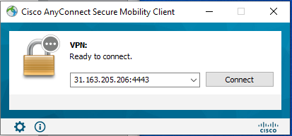
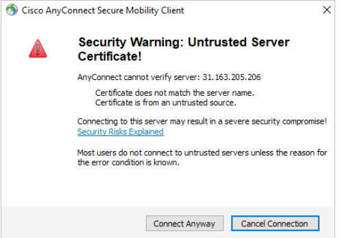
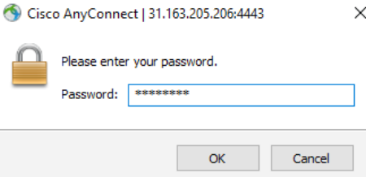
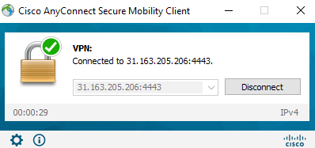
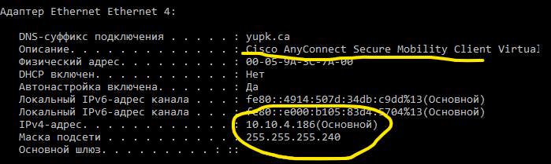
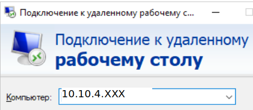

Настройка VPN
=============

Создание VPN подключения
~~~~~~~~~~~~~~~~~~~~~~~~

Windows:

Выполняется для подключения к виртуальной машине с установленным программным обеспечением на сервере образователього учреждения

Установка CiscoAnyConnect и создание подключения
""""""""""""""""""""""""""""""""""""""""""""""""

1. Установить программу anyconnect_.
.. _anyconnect: https://cloud.mail.ru/public/QLCf/2utPKwWXT

2. Отключить Брандмауэр
3. Выполнить Пуск->Cisco Connect Secure Mobility Client

.. figure:: vpn_01.png
       :scale: 100 %
       :align: center
       :alt: asda

4. Открыть окно настроек 
5. Выбрать закладку Preferences и убрать параметр Block connections to untrasted servers

.. figure:: vpn_02.png
       :scale: 100 %
       :align: center
       :alt: asda
       
6. Закрыть диалоговое окно настроек
7. Нажать кнопку Connect
8. В поле адреса подключения введите: 31.163.205.206:4443

       
9. Нажмите **Connect**
10. В окне Security Warning нажмите **Connect Anyway**
 

       
11. Введите логин
 
 .. figure:: vpn_05.png
       :scale: 100 %
       :align: center
       :alt: asda

12. Нажмите **Ok**
13. Введите пароль 

       
14. Нажмите Ok
15. **Accept->ConnectAnyway**
16. Подключение выполнено

       
17. После подключения окошко сворачивается в трей
18. Ваш компьютер должен получить адрес из сети 10.10.4.176/27
19. Win+R->cmd->ipconfig /all

Подключение к стенду
""""""""""""""""""""

1. Win+R->cmd->mstsc
2. В окне подключения введите IP адрес своей виртуальной машины: 10.10.4.XXX

