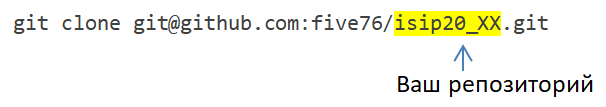
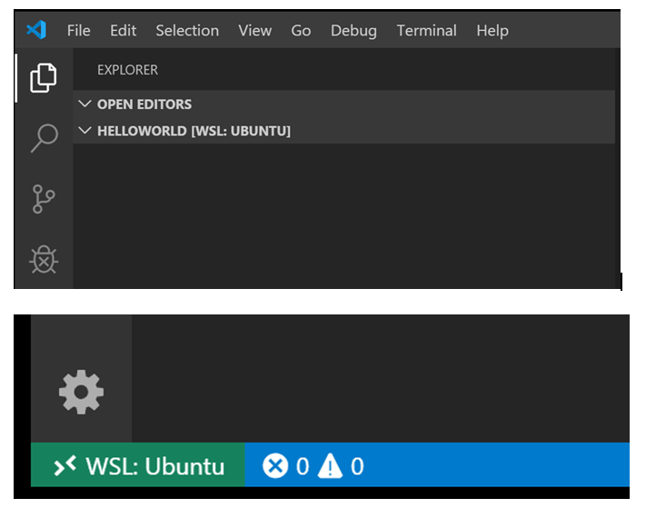
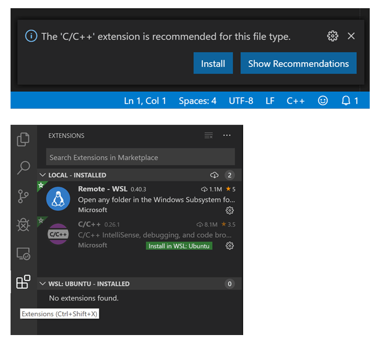

Установка Visual Studio Code  в Windows
==========================================
С административными правами:

1. Выполнить инструкцию, представленную на странице

https://code.visualstudio.com/docs/cpp/config-mingw

2. Установить и настроить **git**

2.1) Скачать и установить git

https://git-scm.com/download/win

2.2) Добавить путь к git.exe в системную переменную PATH

https://www.delftstack.com/howto/git/add-git-to-path-on-windows/#manually-add-git-to-the-path-on-windows

3. Войти в систему под учетной записью пользователя

4. Настроить глобальные параметры git

::

        win+R
        cmd

.. figure:: instvsc/gitname.png
        :scale: 100%
        :align: center

5. Создать каталог **oapisip**

::
        
        mkdir ~/oapisip
        cd ~/oapisip

13. Склонировать в данный каталог свой репозиторий

        
14. Перейти в каталог  **exercises/03_linprogr/class/**

::

        cd exercises/03_linprogr/class/

или

::

        cd ~/oapisip/isip20_XX/exercises/03_linprogr/class/
        
15. Запустить **VS Code in WSL** из этого каталога

::
        
        code .

16. Install the C/C++ extension

17. Открыть в Code 

::

        cd ~/oapisip/isip20_XX/exercises/03_linprogr/home
        code .
        
18. Вписать в task_03_01.cpp

::

        #include<iostream>
        #include<cmath>

19. Сохранить
20. Отправить на github

::

        git add .
        git commit -m “Update task_03_01.cpp”
        git push origin main

.. note:: Для скачивания имеющихся обновлений с github в свой локальный репозиторий: **git pull**

     

        

