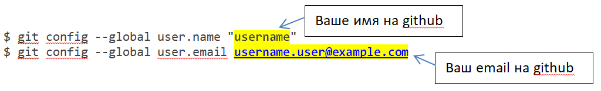
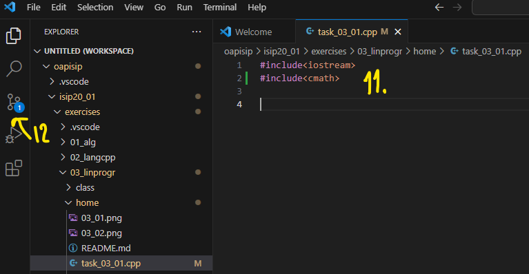
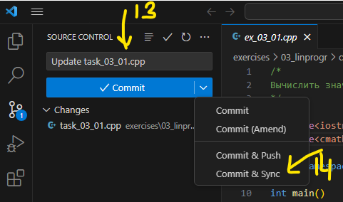
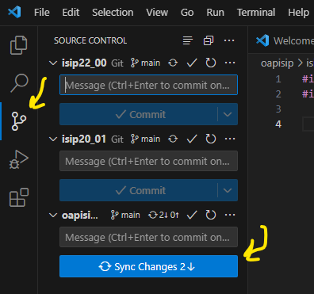
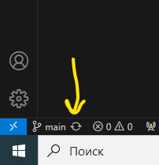

Установка Visual Studio Code  в Windows
==========================================

С административными правами:

1. Выполнить инструкцию, представленную на странице

https://code.visualstudio.com/docs/cpp/config-mingw

2. Установить и настроить **git**

2.1) Скачать и установить git

https://git-scm.com/download/win

2.2) Добавить путь к git.exe в системную переменную PATH

https://www.delftstack.com/howto/git/add-git-to-path-on-windows/#manually-add-git-to-the-path-on-windows

3. Войти в систему под учетной записью пользователя

4. Настроить глобальные параметры git

::

        win+R
        cmd

5. Сгенерировать ключ доступа по SSH для вашей ОС. 

Добавление ключа позволить скачивать и обновлять содержимое репозитория без ввода паролей.

5.1) Запустить GitBash 

5.2) Ввести команду

        
При создании нажать несколько раз Enter (принять параметры по-умолчанию)

6. Добавить SSH-ключ на GitHub

Для добавления ключа надо его скопировать. Например, таким образом можно отобразить ключ для копирования:

::

        cat ~/.ssh/id_rsa.pub
        
После копирования надо перейти на GitHub. Находясь на любой странице GitHub, в правом верхнем углу нажмите на картинку вашего профиля и в выпадающем списке выберите **«Settings»**. В списке слева надо выбрать поле **«SSH and GPG keys»**. После этого надо нажать **«New SSH key»** и в поле **«Title»** написать название ключа (например «Home»), а в поле **«Key»** вставить содержимое, которое было скопировано из файла ~/.ssh/id_rsa.pub.

7. Создать каталог **oapisip**

::
        
        mkdir oapisip
        cd oapisip

8. Запуcтить Visual Studio Code 

code .

9. Склонировать в данный каталог свой репозиторий:

9.1) В окне **Welcome** (Help->Welcome) выбрать **Clone Git Repository** 

9.2) В командной строке вписать **git@github.com:five76/isip20_XX.git** (XX - ваш номер)

9.3) Подтвердить клонирование кликом мыши

10. Открыть каталог **oapisip/isip20_XX/exercises/03_linprogr/home**
       
11. Вписать в task_03_01.cpp (рис.1, 11)

::

        #include<iostream>
        #include<cmath>

Рис. 1

12. Сохранить (Ctrl+S)

13. Отправить изменения на github

13.1) Нажать кнопку  **Source Control** (рис.1, 12)

13.2) В поле **Commit** ввести текст **Update task_03_01.cpp** (рис. 2, 13)

13.3) Выбрать команду **Commit & Sync** (рис. 2, 14). На все вопросы отвечать утвердительно (Yes, Ok)

Рис. 2

14. Перед выполнением работы на другом компьютере требуется синхронизировать изменения, для этого необходимо выполнить **Control Source -> Sync Changes** (рис. 3) или нажать кнопку 
**Synchronize Changes** в левом нижнем углу рабочей области (рис. 4)

Рис. 3

Рис. 4

        

