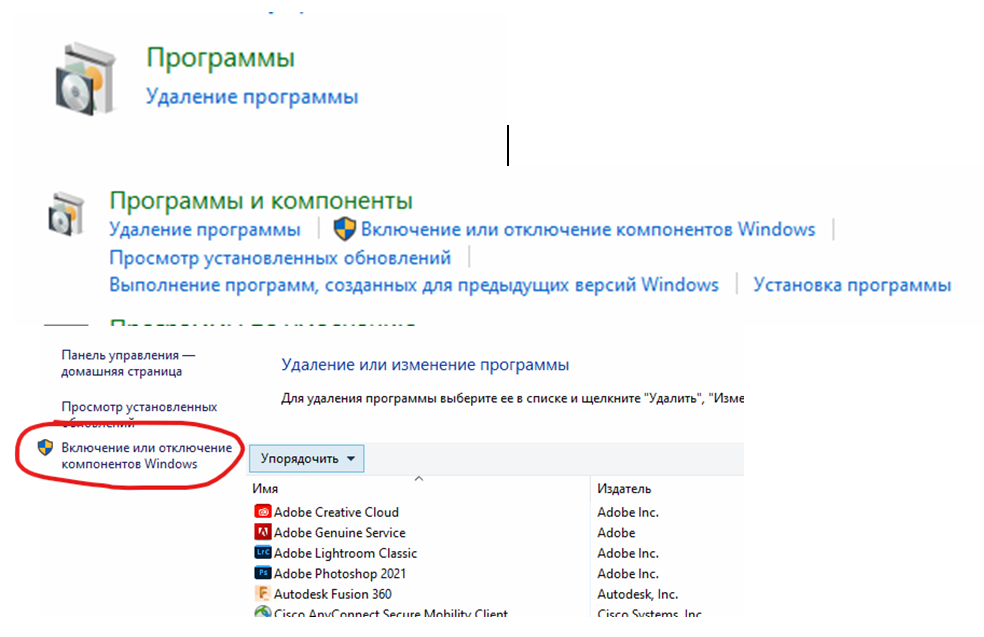
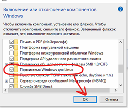

Установка Visual Studio Code
===============================

https://code.visualstudio.com/docs/cpp/config-wsl

1.	Установить Дополнительный компонент "Подсистема Windows для Linux" 

Выбрать **Панель управления** -> **Программы и компоненты** -> **Включение или отключение компонентов Windows** и установите флажок **Подсистема Windows для Linux**

.. figure:: instvsc/instvsc01.png
        :scale: 100%
        :align: center

        
        

        
2. Перезагрузить компьютер
3. Установиь **Visual Studio Code** (https://code.visualstudio.com/download)
4. Установить **Remote - WSL extension** (https://marketplace.visualstudio.com/items?itemName=ms-vscode-remote.remote-wsl)
5. Установить **Windows Subsystem for Linux**
   * Запустить PowerShell от имени администратора
