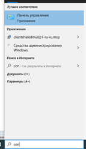

Установка Visual Studio Code
===============================

https://code.visualstudio.com/docs/cpp/config-wsl

1.	Установить Дополнительный компонент "Подсистема Windows для Linux" 

   Выберите Панель управления -> Программы и компоненты -> Включение или отключение компонентов Windows и установите флажок Подсистема Windows для Linux 

2. 
