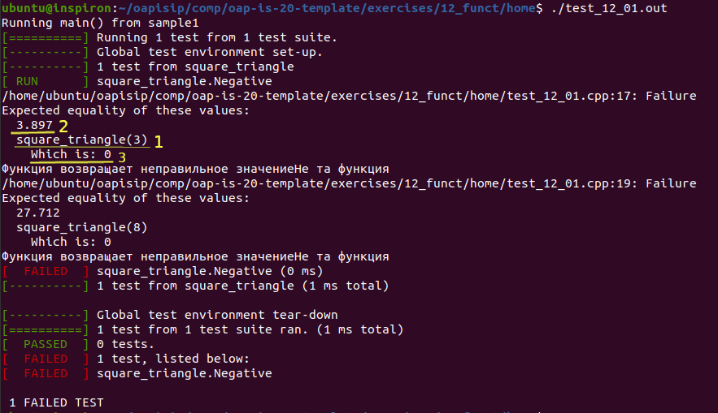

Тестирование программного кода
==========================================

После написания, проверки и отладки программы необходимо выполнить тестирование программного кода. Для это цели для каждого задания **task_** в каталоге имеется файл **test_**. Например, для task_12_01.cpp - test_12_01.cpp 

1) Установить фреймворк для написания (использования) модульных тестов  

На Ubuntu:

::

	sudo apt-get install libgtest-dev

2) В каталоге **home** установить полные права на запуск программы  **testhomework**

::

	sudo chmod 777 testhomework

3) Для выполнения тестирования необходимо запустить программу **testhomework** с аргументом **-a**, если выполняется пакетное тестирование всех программ или указать имя файл-теста **test_12_01.cpp**, если тестируется только один файл. 

Например:

Все задания:

::

	./testhomework -a

или одно задание **task_12_01.cpp**

::

	./testhomework test_12_01.cpp

Результаты тестирования:

**PASSED** - успешно

**FAILED** - тест провален

Файлы, прошедшие тестирование автоматически отправляются на github.com с необходимым commit-ом

Для просмотра ошибок в командной строке необходимо ввести команду:

::

	./test_12_01.out

	:align: center
	:scale: 100%

**Рисунок 12**

В данном примере показано, что тестируется функция **square_triangle(3)** (рис. 12, 1) которой передается значение 3
Ожидается ответ **3.897** (рис. 12, 2)

Получен ответ (which is) **0** (рис. 12, 3)

Данный тест запускается дважды с разными значениями

**Подделывать результаты тестов не имеет смысла, так как программный код проверяется на стороне преподавателя**
  
**Изучение работы unit-тестов приветствуется**
